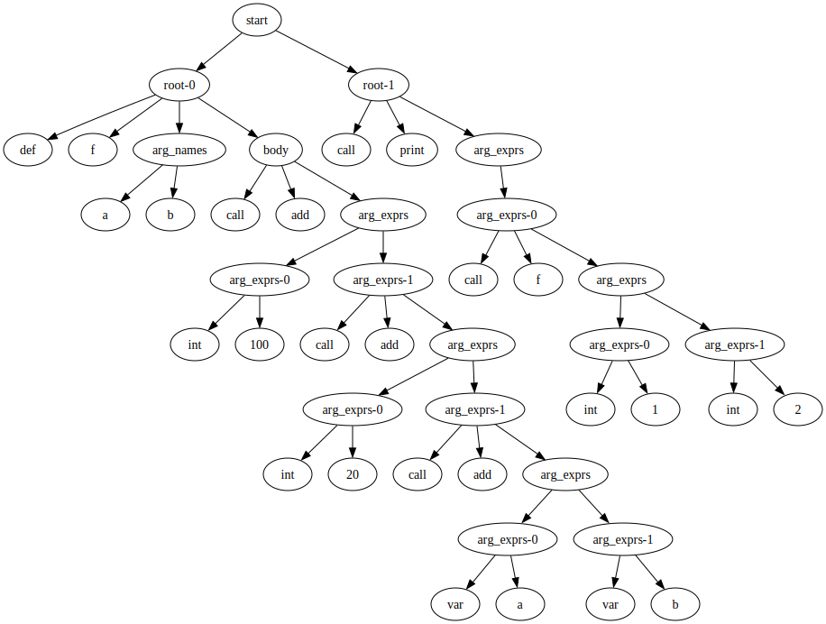
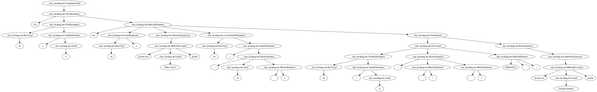
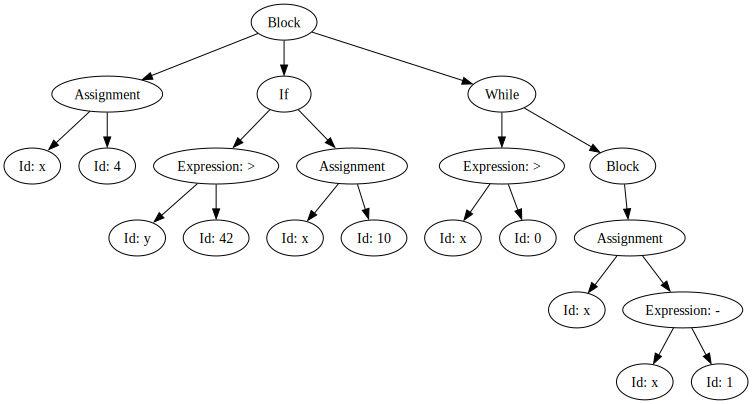

# Syntax-based Analysis

Given a token stream produced by a lexer, the objective of a parser is to construct a tree that captures the syntactic relation between the tokens.

## CCLearner: Deep learning clone detection 

We've already explored different code clone detection techniques, now it's time for yet another:

Li, L., Feng, H., Zhuang, W., Meng, N., & Ryder, B. (2017, September). Cclearner: A deep learning-based clone detection approach. In 2017 IEEE International Conference on Software Maintenance and Evolution (ICSME) (pp. 249-260). IEEE.

The idea of CCLearner is to compare code snippets in terms of the token frequencies. For this, the approach distinguishes the following token types:
- Reserved words
- Operators 
- Markers
- Literals
- Type identifiers
- Method idenfiers
- Qualified names
- Variable identifiers

If you think about our tokenization approach from the last chapter, you'll realize there's a problem here: While we did distinguish between different types of tokens, our tokenizer cannot distinguish between type, method, qualified, and variable identifiers -- this was all just classified as "identifier". In order to distinguish these types of tokens we need to consider the syntactic context. This is what a parser does given a token stream.

## Parsing programs

We will construct a simple parser for a trivial example language that resembles Python. Here's an example program:

```
def f(a, b)
    add(100, add(20, add(a, b)))
end

print(f(1, 2))
```


```python
code = """def f(a, b)
    add(100, add(20, add(a, b)))
end

print(f(1, 2))
"""
```

The language contains function definitions, function calls, integer literals, and variable references. It also makes use of two undefined functions `add` and `print` which will be defined later.

### Tokenization

A prerequisite for a parser is the token stream. We implemented a lexer in the last chapter in a very basic way, and in the end realised that what we had produced was an automaton matching regular expressions. We can thus implement a simpler lexer by defining the token types in terms of regular expressions.


```python
from collections import namedtuple
import re
```

We won't actually need the position so let's just focus on lexemes and token types.


```python
Token = namedtuple('Token', 'token_type value')
```

For our example language, we define the following token types:


```python
TOKEN_TYPES = [
    (r'\bdef\b',        'def'),
    (r'\bend\b',        'end'),
    (r'\b[a-zA-Z]+\b',  'identifier'),
    (r'\b[0-9]+\b',     'integer'),
    (r'\(',             'oparen'),
    (r'\)',             'cparen'),
    (r',',              'comma'),
]
```


```python
def tokenize(code):
    tokens = []
    
    remaining_code = code
    
    while remaining_code:
        for regex, token_type in TOKEN_TYPES:
            match = re.match(regex, remaining_code)
            if match:
                value = match.group()
                remaining_code = remaining_code[len(value):].strip()
                tokens.append(Token(token_type, value))
    
    return tokens
```


```python
tokenize(code)
```


    [Token(token_type='def', value='def'),
     Token(token_type='identifier', value='f'),
     Token(token_type='oparen', value='('),
     Token(token_type='identifier', value='a'),
     Token(token_type='comma', value=','),
     Token(token_type='identifier', value='b'),
     Token(token_type='cparen', value=')'),
     Token(token_type='identifier', value='add'),
     Token(token_type='oparen', value='('),
     Token(token_type='integer', value='100'),
     Token(token_type='comma', value=','),
     Token(token_type='identifier', value='add'),
     Token(token_type='oparen', value='('),
     Token(token_type='integer', value='20'),
     Token(token_type='comma', value=','),
     Token(token_type='identifier', value='add'),
     Token(token_type='oparen', value='('),
     Token(token_type='identifier', value='a'),
     Token(token_type='comma', value=','),
     Token(token_type='identifier', value='b'),
     Token(token_type='cparen', value=')'),
     Token(token_type='cparen', value=')'),
     Token(token_type='cparen', value=')'),
     Token(token_type='end', value='end'),
     Token(token_type='identifier', value='print'),
     Token(token_type='oparen', value='('),
     Token(token_type='identifier', value='f'),
     Token(token_type='oparen', value='('),
     Token(token_type='integer', value='1'),
     Token(token_type='comma', value=','),
     Token(token_type='integer', value='2'),
     Token(token_type='cparen', value=')'),
     Token(token_type='cparen', value=')')]


### Parsing

We can now build a parser that constructs a parse tree, thus implicitly defining a grammar for our language. This is slightly more involved, so we will  construct this in an object oriented way.


```python
class Parser:
    def __init__(self, tokens):
        self.tokens = list(tokens)
```

The parser matches tokens based on a grammar. If the next token does not match a type allowed by the grammar, the parser reports an error.


```python
class Parser(Parser):
    def consume(self, expected_type):
        token = self.tokens.pop(0)
        if token.token_type == expected_type:
            return token
        else:
            raise RuntimeError(
                f"Expected token type {expected_type!r} "
                f"but got {token.token_type!r}."
            )
```

We now implicitly define our grammar by implementing each production as a function. Integer literals simply produce leaf nodes.


```python
class Parser(Parser):
    def parse_integer(self):
        return dict(
            node_type='int',
            value=int(self.consume('integer').value),
        )
```


```python
example = "5"
parser = Parser(tokenize(example))
parser.parse_integer()
```


    {'node_type': 'int', 'value': 5}


Similarly, variable nodes are leaf nodes containing the variable name.


```python
class Parser(Parser):
    def parse_var_ref(self):
        return dict(
            node_type='var',
            name=self.consume('identifier').value,
        )
```


```python
example = "x"
parser = Parser(tokenize(example))
parser.parse_var_ref()
```


    {'node_type': 'var', 'name': 'x'}


Function calls are slightly more involved since they are not just individual tokens. To determine which grammar rule we are matching we sometimes need to look ahead.


```python
class Parser(Parser):
    def peek(self, expected_type, offset=0):
        return self.tokens[offset].token_type == expected_type
```

A function call consists of a call node that contains the name of the function called, and nodes for the arguments, if there are any.


```python
class Parser(Parser):
    def parse_call(self):
        name = self.consume('identifier').value
        arg_exprs = list(self.parse_arg_exprs())
        return dict(
            node_type='call',
            name=name,
            arg_exprs=arg_exprs,\
        )

    def parse_arg_exprs(self):
        self.consume('oparen')
        if not self.peek('cparen'):
            yield self.parse_expr()
            while self.peek('comma'):
                self.consume('comma')
                yield self.parse_expr()
        self.consume('cparen')
```


```python
class Parser(Parser):
    def parse_expr(self):
        if self.peek('integer'):
            return self.parse_integer()
        elif self.peek('identifier') and self.peek('oparen', 1):
            return self.parse_call()
        else:
            return self.parse_var_ref()
```


```python
example = "foo(5)"
parser = Parser(tokenize(example))
parser.parse_call()
```


    {'node_type': 'call',
     'name': 'foo',
     'arg_exprs': [{'node_type': 'int', 'value': 5}]}


```python
class Parser(Parser):
    def parse_def(self):
        self.consume('def')
        name = self.consume('identifier').value
        arg_names = list(self.parse_arg_names())
        body = self.parse_expr()
        self.consume('end')
        return dict(
            node_type='def',
            name=name,
            arg_names=arg_names,
            body=body,
        )

    def parse_arg_names(self):
        self.consume('oparen')
        if self.peek('identifier'):
            yield self.consume('identifier').value
            while self.peek('comma'):
                self.consume('comma')
                yield self.consume('identifier').value
        self.consume('cparen')
```


```python
parser = Parser(tokenize(code))
parser.parse_def()
```


    {'node_type': 'def',
     'name': 'f',
     'arg_names': ['a', 'b'],
     'body': {'node_type': 'call',
      'name': 'add',
      'arg_exprs': [{'node_type': 'int', 'value': 100},
       {'node_type': 'call',
        'name': 'add',
        'arg_exprs': [{'node_type': 'int', 'value': 20},
         {'node_type': 'call',
          'name': 'add',
          'arg_exprs': [{'node_type': 'var', 'name': 'a'},
           {'node_type': 'var', 'name': 'b'}]}]}]}}


Finally, we need to implement the start rule of our grammar.


```python
class Parser(Parser):
    def parse(self):
        while self.tokens:
            if self.peek('def'):
                yield self.parse_def()
            else:
                yield self.parse_call()
```


```python
tree = Parser(tokenize(code)).parse()
```


```python
list(tree)
```


    [{'node_type': 'def',
      'name': 'f',
      'arg_names': ['a', 'b'],
      'body': {'node_type': 'call',
       'name': 'add',
       'arg_exprs': [{'node_type': 'int', 'value': 100},
        {'node_type': 'call',
         'name': 'add',
         'arg_exprs': [{'node_type': 'int', 'value': 20},
          {'node_type': 'call',
           'name': 'add',
           'arg_exprs': [{'node_type': 'var', 'name': 'a'},
            {'node_type': 'var', 'name': 'b'}]}]}]}},
     {'node_type': 'call',
      'name': 'print',
      'arg_exprs': [{'node_type': 'call',
        'name': 'f',
        'arg_exprs': [{'node_type': 'int', 'value': 1},
         {'node_type': 'int', 'value': 2}]}]}]


We can visualize the syntax tree using a little helper function.


```python
from graphviz import Digraph

unique_id = 0

def print_tree(node):
    dot = Digraph()
    num = 0
    dot.node("root", "start")
    for child in list(node):
        child_id = add_nodes(dot, child, f"root-{num}")
        dot.edge("root", child_id)
        num += 1
    return dot

def add_nodes(dot, node, name):
    global unique_id
   
    if isinstance(node, dict):
        dot.node(str(id(node)), name)
        for key, value in node.items():
            child_id = add_nodes(dot, value, key)
            dot.edge(str(id(node)), child_id)
        return str(id(node))
                
    elif isinstance(node, str):
            node_id = unique_id
            unique_id += 1
            dot.node(str(node_id), node)
            return str(node_id)

    elif isinstance(node, int):
            node_id = unique_id
            unique_id += 1
            dot.node(str(node_id), str(node))
            return str(node_id)

    elif isinstance(node, list):
        dot.node(str(id(node)), name)
        num = 0
        for child in node:
            child_id = add_nodes(dot, child, f"{name}-{num}")
            dot.edge(str(id(node)), child_id)
            num += 1
        return str(id(node))
```


```python
root_nodes = list(Parser(tokenize(code)).parse())
```


```python
print_tree(root_nodes)
```


    

    


Note that this is not yet an _abstract_ syntax tree: It is a parse tree, exactly representing the grammar used, including all tokens. In contrast, an abstract syntax tree describes the parse tree logically and does not need to contain all the syntactical constructs. While a parse tree only has non-terminal nodes as non-leaf nodes, an abstract syntax tree can, for example, contain operators as interor nodes, with the operands being leaves.

### Revisiting CCLearner

If we want to parse real languages, we'll often find existing parsers. To process Java code in Python, we can use Javalang.


```python
code1 = """
public class Foo {
  public void foo(int x) {
    System.out.println("Hello Clone!");
    int j = 10;
    for(int i = 0; i < x; i++) {
      System.out.println("Another iteration");
    }
  }
}
"""
```


```python
code2 = """
public class Foo {
  private int y = 0;
  
  public void foo(int x) {
    System.out.println("Hello Clone!");
    int j = 10 + y;
    for(int i = 0; i < x; i++) {
      System.out.println("Another iteration");
    }
  }
}
"""
```


```python
import javalang
```


```python
javalang.parse.parse(code2)
```


    CompilationUnit(imports=[], package=None, types=[ClassDeclaration(annotations=[], body=[FieldDeclaration(annotations=[], declarators=[VariableDeclarator(dimensions=[], initializer=Literal(postfix_operators=[], prefix_operators=[], qualifier=None, selectors=[], value=0), name=y)], documentation=None, modifiers={'private'}, type=BasicType(dimensions=[], name=int)), MethodDeclaration(annotations=[], body=[StatementExpression(expression=MethodInvocation(arguments=[Literal(postfix_operators=[], prefix_operators=[], qualifier=None, selectors=[], value="Hello Clone!")], member=println, postfix_operators=[], prefix_operators=[], qualifier=System.out, selectors=[], type_arguments=None), label=None), LocalVariableDeclaration(annotations=[], declarators=[VariableDeclarator(dimensions=[], initializer=BinaryOperation(operandl=Literal(postfix_operators=[], prefix_operators=[], qualifier=None, selectors=[], value=10), operandr=MemberReference(member=y, postfix_operators=[], prefix_operators=[], qualifier=, selectors=[]), operator=+), name=j)], modifiers=set(), type=BasicType(dimensions=[], name=int)), ForStatement(body=BlockStatement(label=None, statements=[StatementExpression(expression=MethodInvocation(arguments=[Literal(postfix_operators=[], prefix_operators=[], qualifier=None, selectors=[], value="Another iteration")], member=println, postfix_operators=[], prefix_operators=[], qualifier=System.out, selectors=[], type_arguments=None), label=None)]), control=ForControl(condition=BinaryOperation(operandl=MemberReference(member=i, postfix_operators=[], prefix_operators=[], qualifier=, selectors=[]), operandr=MemberReference(member=x, postfix_operators=[], prefix_operators=[], qualifier=, selectors=[]), operator=<), init=VariableDeclaration(annotations=[], declarators=[VariableDeclarator(dimensions=None, initializer=Literal(postfix_operators=[], prefix_operators=[], qualifier=None, selectors=[], value=0), name=i)], modifiers=set(), type=BasicType(dimensions=[], name=int)), update=[MemberReference(member=i, postfix_operators=['++'], prefix_operators=[], qualifier=, selectors=[])]), label=None)], documentation=None, modifiers={'public'}, name=foo, parameters=[FormalParameter(annotations=[], modifiers=set(), name=x, type=BasicType(dimensions=[], name=int), varargs=False)], return_type=None, throws=None, type_parameters=None)], documentation=None, extends=None, implements=None, modifiers={'public'}, name=Foo, type_parameters=None)])


It might be helpful to see the tree structure visualised.


```python
from graphviz import Digraph
def print_tree(tree):
    unique_id = 1
    dot = Digraph()
    for path, node in tree:
        dot.node(str(id(node)), str(type(node)))
        
        for child in node.children:
            if isinstance(child, javalang.ast.Node):
                dot.edge(str(id(node)), str(id(child)))
            elif type(child) == str:
                strid = str(unique_id)
                unique_id = unique_id + 1
                dot.node(strid, child)
                dot.edge(str(id(node)), strid)
            elif type(child) == list:
                for lc in child:
                    dot.edge(str(id(node)), str(id(lc)))
                 
    return dot
```


```python
tree = javalang.parse.parse(code2)
print_tree(tree)
```


    

    


In contrast to our parse tree shown earlier, this is an actual _abstract_ syntax tree. To construct an AST, one needs to extend the implementations of the different productions to instantiate the appropriate node structures required.

CCLearner defines eight different types of tokens for the clone analysis.


```python
reserved   = {} # C1
operators  = {} # C2
markers    = {} # C3
literals   = {} # C4
type_ids   = {} # C5
method_ids = {} # C6
qualified_ids = {} # C7
variable_ids  = {} # C8
```


```python
def increment(dictionary, key):
    if key in dictionary:
        dictionary[key] += 1
    else:
        dictionary[key] = 1
```

The first three types of tokens can easily be extracted using a tokenizer.


```python
for token in javalang.tokenizer.tokenize(code2):
    # C1
    if token.__class__.__name__ == "Keyword":
        increment(reserved, token.value)

    # C2
    elif token.__class__.__name__ == "Operator":
        increment(operators, token.value)
    
    # C3
    elif token.__class__.__name__ == "Separator":
        increment(markers, token.value)
```

Type C4 (Literals) already comes with some challenges. For example, consider the following snippet of code and its tokens:


```python
list(javalang.tokenizer.tokenize("int i = -1;"))
```


    [BasicType "int" line 1, position 1,
     Identifier "i" line 1, position 5,
     Operator "=" line 1, position 7,
     Operator "-" line 1, position 9,
     DecimalInteger "1" line 1, position 10,
     Separator ";" line 1, position 11]


The number `-1` is split into two tokens, but for the sake of CCLearner's analysis it would be preferable to use a single number.

To extract literals values, we can, however, use the AST:


```python
example_tree = javalang.parse.parse("class Test {int i = -1;}")
```


```python
for _, node in example_tree.filter(javalang.tree.Literal):
    print(f"Literal: {node}")
```

    Literal: Literal(postfix_operators=[], prefix_operators=['-'], qualifier=None, selectors=[], value=1)


We thus need to prepend the prefix operators when collecting literals.


```python
for _, node in tree.filter(javalang.tree.Literal):
    result = "".join(node.prefix_operators) + node.value
    # C4
    increment(literals, result)
```


```python
for _, node in tree.filter(javalang.tree.Type):
    # C5
    increment(type_ids, node.name)
```

For C6 we require all method names, which are part of MethodDeclarations and MethodInvocations


```python
for _, node in tree.filter(javalang.tree.MethodInvocation):
    # C6
    increment(method_ids, node.member)
```


```python
for _, node in tree.filter(javalang.tree.MethodDeclaration):
    # C6
    increment(method_ids, node.name)
```

Qualified names (C7 tokens) are explicitly available in the AST.


```python
for _, node in tree.filter(javalang.tree.Primary):
    # C7
    if node.qualifier:
        increment(qualified_ids, node.qualifier)
```

Variable identifiers (C8 tokens) are slightly more inconvenient to extract than the other tokens because they can occur at multiple different types of locations.


```python
for _, node in tree.filter(javalang.tree.VariableDeclarator):
    # C8
    increment(variable_ids, node.name)

for _, node in tree.filter(javalang.tree.FormalParameter):
    # C8
    increment(variable_ids, node.name)
    
for _, node in tree.filter(javalang.tree.MemberReference):
    # C8
    increment(variable_ids, node.member)
```


```python
print(reserved)
print(operators)
print(markers)
print(literals)
print(type_ids)
print(method_ids)
print(qualified_ids)
print(variable_ids)
```

    {'class': 1, 'void': 1, 'for': 1}
    {'=': 3, '+': 1, '<': 1, '++': 1}
    {'{': 3, ';': 6, '(': 4, ')': 4, '.': 4, '}': 3}
    {'0': 2, '"Hello Clone!"': 1, '10': 1, '"Another iteration"': 1}
    {'int': 4}
    {'println': 2, 'foo': 1}
    {'System.out': 2}
    {'y': 2, 'j': 1, 'i': 3, 'x': 2}


Now we can place all the conditions from above into a function that derives the tokens for a given snippet of code.


```python
def get_tokens(code):
    
    tokens = { 
        "reserved" : {},
        "operators" : {},
        "markers" : {},
        "literals" : {},
        "type_ids" : {},
        "method_ids" : {},
        "qualified_ids" : {},
        "variable_ids" : {}
             }

    for token in javalang.tokenizer.tokenize(code):
        # C1
        if token.__class__.__name__ == "Keyword":
            increment(tokens["reserved"], token.value)
        # C2
        elif token.__class__.__name__ == "Operator":
            increment(tokens["operators"], token.value)    
        # C3
        elif token.__class__.__name__ == "Separator":
            increment(tokens["markers"], token.value)

    tree = javalang.parse.parse(code)
    for _, node in tree.filter(javalang.tree.Literal):
        result = "".join(node.prefix_operators) + node.value
        # C4
        increment(tokens["literals"], result)
    for _, node in tree.filter(javalang.tree.Type):
        # C5
        increment(tokens["type_ids"], result)
    for _, node in tree.filter(javalang.tree.MethodInvocation):
        # C6
        increment(tokens["method_ids"], node.member)
    for _, node in tree.filter(javalang.tree.MethodDeclaration):
        # C6
        increment(tokens["method_ids"], node.name)
    for _, node in tree.filter(javalang.tree.Primary):
        # C7
        if node.qualifier:
            increment(tokens["qualified_ids"], node.qualifier)
    for _, node in tree.filter(javalang.tree.VariableDeclarator):
        # C8
        increment(tokens["variable_ids"], node.name)
    for _, node in tree.filter(javalang.tree.FormalParameter):
        # C8
        increment(tokens["variable_ids"], node.name)
    for _, node in tree.filter(javalang.tree.MemberReference):
        increment(tokens["variable_ids"], node.member)
        # C8
        
    return tokens
```


```python
get_tokens(code1)
```


    {'reserved': {'class': 1, 'void': 1, 'for': 1},
     'operators': {'=': 2, '<': 1, '++': 1},
     'markers': {'{': 3, '(': 4, ')': 4, '.': 4, ';': 5, '}': 3},
     'literals': {'"Hello Clone!"': 1, '10': 1, '0': 1, '"Another iteration"': 1},
     'type_ids': {'"Another iteration"': 3},
     'method_ids': {'println': 2, 'foo': 1},
     'qualified_ids': {'System.out': 2},
     'variable_ids': {'j': 1, 'i': 3, 'x': 2}}


The similarity for a given cataegory tokens is calculated as 1 minus the difference of token frequencies over the sums of token frequencies.


```python
def sim_score(tokens1, tokens2):
    if not tokens1 or not tokens2:
        return 0.5 # See paper
    
    tokens = list(tokens1.keys()) + list(tokens2.keys())
    
    diff = 0
    summ = 0 
    
    for token in tokens:
        num1 = tokens1[token] if token in tokens1 else 0
        num2 = tokens2[token] if token in tokens2 else 0
        diff += num1 - num2
        summ += num1 + num2
    
    return 1.0 - diff / summ
```


```python
code3 = """
public class Bar {
  public void bar(int x) {
    System.out.println("Completely different text!");
    int j = 200; // completely different numbers
    for(int i = 100; i < x; i++) {
      System.out.println("More complete different text");
    }
  }
}
"""
```


```python
code4 = """
public class Bar {
  public void bar(int x) {
        MultiLayerNetwork model = new MultiLayerNetwork(conf);
        model.init();
        model.setListeners(Collections.singletonList((IterationListener) new ScoreIterationListener(10)));


        for (int n = 0; n < nEpochs; n++) {
            model.fit(trainIter);
        }

        File model_File = new File(output_dir + "model.mdl");
  }
}
"""
```


```python
tokens1 = get_tokens(code1)
tokens2 = get_tokens(code2)
tokens3 = get_tokens(code3)
tokens4 = get_tokens(code4)
```


```python
sim_score(tokens1["markers"], tokens2["markers"])
```


    1.0212765957446808


```python
def feature_vector(tokens1, tokens2):
    similarity = []
    for key in tokens1.keys():
        similarity.append(sim_score(tokens1[key], tokens2[key]))
    return similarity
```


```python
feature_vector(tokens1, tokens2)
```


    [1.0,
     1.1578947368421053,
     1.0212765957446808,
     1.1111111111111112,
     1.1428571428571428,
     1.0,
     1.0,
     1.0769230769230769]


```python
feature_vector(tokens1, tokens4)
```


    [1.2,
     1.1578947368421053,
     1.2333333333333334,
     0.9090909090909091,
     1.4545454545454546,
     1.25,
     1.3333333333333333,
     1.1578947368421053]


At this point, we can train a machine learning model given a labelled dataset of pairs of code snippets. For each pair of code snippets we would calculate the feature vector, and then update train the model based on the label for that pair. However, rather than doing this, we will take our prediction even a step further and use more syntactical information for our prediction.

## Generating Parsers

Earlier we built a small parser for an example language, extracted parse trees, and used syntax trees to convert source code to a format suitable for machine learning applications. Writing the parser was hard work, even though we only looked at a very simplistic language -- doing the same for "real" programming languages would be very cumbersome. Luckily, we don't need to construct parsers by hand, but can resort to compiler construction tools. We will be using [Antlr](https://www.antlr.org/) to have some parsers generated for us.

The starting point for a parser generator is a grammar describing the language, as well as lexical information that helps tokenizing raw text. In Antlr, both are specified in the same file; by convention, terminals are named in all caps and specified using regular expressions, while terminals are written in lower case.

```
grammar Expr1;

expr : expr '+' term  |
       expr '-' term  |
       term;

term : DIGIT ;

DIGIT : ('0'..'9') ;
WS : [ \t\r\n]+ -> skip ;
```

This grammar tells Antlr to skip whitespacaes (`WS`), to match individual digits (`DIGIT`), and then describes a simple grammar of expressions consisting of addition and subtraction of terms (which are simply individual digits for now).

Antlr will automatically produce a lexer and a parser and some more helpful files for us given such a grammar. To avoid a dependency on Antlr the notebook is not going to call Antlr directly, but we include the files produced by Antlr in the repository directly.

To process the above grammar with Antlr, we would need to save the grammar in a file `Expr1.g4`, and then call Antlr like so:

```
 antlr -Dlanguage=Python3 -visitor Expr1.g4
```

The `language` option tells Antlr which programming language the parser should be generated in.

The generated files are included in the `antlr` subdirectory of this notebook's repository.


```python
!ls antlr/Expr1*
```

    antlr/Expr1.g4          antlr/Expr1Lexer.interp antlr/Expr1Listener.py
    antlr/Expr1.interp      antlr/Expr1Lexer.py     antlr/Expr1Parser.py
    antlr/Expr1.tokens      antlr/Expr1Lexer.tokens antlr/Expr1Visitor.py


`Expr1Lexer.py` is the tokenizer, `Expr1Parser.py` contains the parser, `Expr1Visitor.py` provides a visitor interface for the parse tree, and `Expr1Listener.py` provides an interface with which we can react to parse events while parsing.

Since the generated files are in the `antlr` subdirectory of this notebook's repository, we need to tell Python to include from there.


```python
import sys  
sys.path.insert(0, 'antlr')

import antlr
```

We also need to include the Antlr runtime library (antlr4-python3-runtime).


```python
from antlr4 import *
```

We can now include the generated lexer and parser.


```python
from Expr1Lexer import Expr1Lexer
from Expr1Parser import Expr1Parser
```

The pipeline to parse textual input is to (1) generate an input stream based on the text, (2) create a token stream out of the input stream, and (3) invoke the parser to consume the tokens. The parsing is started by invoking the starting rule of the grammar (`expr` in our case).


```python
input = InputStream('1+2')
lexer = Expr1Lexer(input)
stream = CommonTokenStream(lexer)
parser = Expr1Parser(stream)
tree = parser.expr() 
```

The result (`tree`) is the parse tree produced by `Expr1Parser`. Antlr provides a helper function to look at the parse tree.


```python
from antlr4.tree.Trees import Trees
Trees.toStringTree(tree, None, parser)
```


    '(expr (expr (term 1)) + (term 2))'


## Translating code

We can add attributes to the terminals and nonterminals of our grammar in order to store semantic information, and we can interleave code that is executed by the parser during the parsing process. For example, if we want to convert our expressions from infix notation to postfix notation, we can simply add `print` statements at the appropriate locations.

```
grammar Expr2;

expr : expr '+' term {print("+")} |
       expr '-' term {print("-")} |
       term;

term : DIGIT {print($DIGIT.text) } ;

DIGIT : ('0'..'9') ;
WS : [ \t\r\n]+ -> skip ;
```

The resulting lexer and parser are generated by Antlr as usual, and already included in the repository, so we can immediately parse an expression and convert it to postfix notation.


```python
from Expr2Lexer import Expr2Lexer
from Expr2Parser import Expr2Parser

input = InputStream('1+2+3+4')
lexer = Expr2Lexer(input)
stream = CommonTokenStream(lexer)
parser = Expr2Parser(stream)
tree = parser.expr() 
```

    12+3+4+

Changing the language is simply a matter of updating the grammar rules, and rerunning Antlr. For example, if we want to allow our expressions to contain numbers with more than one digit, we could include a new nonterminal `number` that consists of at least one `DIGIT`.

```
grammar Expr3;

expr : expr '+' term {print("+")} |
       expr '-' term {print("-")} |
       term;

term : number  {print($number.text) } ;

number: DIGIT+;

DIGIT : ('0'..'9') ;
WS : [ \t\r\n]+ -> skip ;
```


```python
from Expr3Lexer import Expr3Lexer
from Expr3Parser import Expr3Parser

input = InputStream('12+2+443+4')
lexer = Expr3Lexer(input)
stream = CommonTokenStream(lexer)
parser = Expr3Parser(stream)
tree = parser.expr() 
```

    12 2 + 443 + 4 + 

Let's make things a bit more challenging and move from these simple expressions to program code. We'll try to parse a simple fictitious language again.


```python
example = """
begin
  x := 4;
  if y > 42 then
    x := 10;
    while x > 0 do
      begin
        x := x - 1
      end
end
"""
```

We'll start by defining the grammar for this language.

```
grammar SimpleProgram;

start : statement
      ;

statement : Identifier ':=' expr        # assignmentStatement
          | 'begin' opt_stmts 'end'     # blockStatement
          | 'if' expr 'then' statement  # ifStatement
          | 'while' expr 'do' statement # whileStatement
          ;

expr : expr op=('+' | '-' | '>') term  # binaryExpr
     | term                      # unaryExpr
     ;

term : Number
     | Identifier
     ;

opt_stmts : statement ';' opt_stmts
          | statement
          ;

Number : Digit+
       ;

Identifier : [a-zA-Z_] [a-zA-Z_0-9]*
           ;

Digit : ('0'..'9') ;
WS : [ \t\r\n]+ -> skip ;
```


```python
from SimpleProgramLexer import SimpleProgramLexer
from SimpleProgramParser import SimpleProgramParser

input = InputStream(example)
lexer = SimpleProgramLexer(input)
stream = CommonTokenStream(lexer)
parser = SimpleProgramParser(stream)
tree = parser.start() 
```


```python
Trees.toStringTree(tree, None, parser)
```


    '(start (statement begin (opt_stmts (statement x := (expr (term 4))) ; (opt_stmts (statement if (expr (expr (term y)) > (term 42)) then (statement x := (expr (term 10)))) ; (opt_stmts (statement while (expr (expr (term x)) > (term 0)) do (statement begin (opt_stmts (statement x := (expr (expr (term x)) - (term 1)))) end))))) end))'


The translation from infix expressions to postfix expressions we did earlier is actually quite similar to the translation from Java source code to Java byte code. Java uses a stack machine, where all operations are performed with regards to an operand stack; thus, similar to a postfix subtraction an operation would take as many operands as it needs from the stack, performs the operation, and pushes the result back on the stack.

To represent our simple program in a bytecode-like notation, we define the following bytecode instructions:
- `HALT`: End of execution
- `LVALUE`: Load variable onto the stack
- `RVALUE`: Store top of stack in a local variable
- `LABEL`: Denote a location as jump target
- `GOTO`: Unconditional jump to target label
- `GOFALSE`: If top of stack represents the value false, then jump to target label
- `IADD`: Pop the top two operands from the stack, push result of addition back to stack
- `ISUB`: Pop the top two operands from the stack, push result of subtraction back to stack
- `CMPGT`: Pop the top two operands from the stack, apply numerical comparison and push integer (0/1) with result back to stack.

The following annotated version of the grammar prints out a bytecode version of the program, in the same way that our annotated grammar converted infix to postfix notation expressions.

```
grammar Expr4;

start : {self.unique_id=10000} statement {
print("HALT") }
      ;

statement : Identifier ':=' expr  {print("LVALUE "+$Identifier.text) }
          | 'begin' opt_stmts 'end'
          | 'if' expr 'then' {
label = str(self.unique_id)
self.unique_id += 1
print("GOFALSE "+label)
          } statement {print("LABEL "+label)
          }
          | 'while' {
label1 = str(self.unique_id)
self.unique_id += 1
label2 = str(self.unique_id)
self.unique_id += 1
print("LABEL "+label1)
                       }
                       expr {
print("GOFALSE "+label2)
                       }
                      'do' statement {
print("GOTO "+label1)
print("LABEL "+label2)
                       }
          ;

expr : expr '+' term {print("IADD") }
     | expr '-' term {print("ISUB") }
     | expr '>' term  {print("CMPGT") }
     | term
     ;
     
term : Number  {print("PUSH "+$Number.text) }
     | Identifier  {print("RVALUE "+$Identifier.text) }
     ;

opt_stmts : statement ';' opt_stmts
          | statement
          ;

Number : Digit+
       ;

Identifier : [a-zA-Z_] [a-zA-Z_0-9]*
           ;

Digit : ('0'..'9') ;
WS : [ \t\r\n]+ -> skip ;
```

As in the other cases the result of running Antlr on this grammar are already in the repository, so we can immidately try to parse the `example` code.


```python
from Expr4Lexer import Expr4Lexer
from Expr4Parser import Expr4Parser

input = InputStream(example)
lexer = Expr4Lexer(input)
stream = CommonTokenStream(lexer)
parser = Expr4Parser(stream)
tree = parser.start() 
```

    PUSH 4
    LVALUE x
    RVALUE y
    PUSH 42
    CMPGT
    GOFALSE 10000
    PUSH 10
    LVALUE x
    LABEL 10000
    LABEL 10001
    RVALUE x
    PUSH 0
    CMPGT
    GOFALSE 10002
    RVALUE x
    PUSH 1
    ISUB
    LVALUE x
    GOTO 10001
    LABEL 10002
    HALT


Our goal actually isn't compilation, but we are considering all this to understand where the Abstract Syntax Tree comes from. The datastructure that Antlr gives us is the raw parse tree, which we could interpret as a _concrete_ parse tree. To create an abstract syntax tree, we need to decide on the abstraction, and create a class hierarchy.


```python
node_id = 0

class ASTNode:
    def __init__(self, name, children = []):
        global node_id
        self.children = children
        self.name = name
        self.id = node_id
        node_id += 1
        
    def get_label(self):
        return self.name
    
    def get_id(self):
        return str(self.id)
```

We need a unique ID for each node in order to visualize the resulting tree with GraphViz; the graph should show a more readable label for each node (`get_label`). We also need the nodes to be aware of their children, such that we can traverse the tree structure.


```python
class Number(ASTNode):
    def __init__(self, num):
        self.number = num
        super().__init__("Number")
```


```python
class Identifier(ASTNode):
    def __init__(self, name):
        self.identifier = name
        super().__init__("Identifier")  
        
    def get_label(self):
        return "Id: "+str(self.identifier)
```


```python
class AssignmentStatement(ASTNode):
    def __init__(self, identifier, expression):
        self.identifier = identifier
        self.expression = expression
        super().__init__("Assignment", [identifier, expression])        
```


```python
class BlockStatement(ASTNode):
    def __init__(self, statements):
        self.statements = statements
        super().__init__("Block", statements )
```

The `BlockStatement` is an example where we are abstracting: The corresponsing node in the concrete syntax tree will be a `Statement` node with three children, the terminals `begin` and `end`, which are irrelevant in our abstraction, and the `opt_stmts`, which is an unnecessary indirection we can avoid by directly adding the statements as children of `BlockStatement`.


```python
class Expression(ASTNode):
    def __init__(self, lhs, rhs, op):
        self.lhs = lhs
        self.rhs = rhs
        self.op  = op
        super().__init__("Expression", [lhs, rhs])
        
    def get_label(self):
        return "Expression: "+str(self.op)
```


```python
class IfStatement(ASTNode):
    def __init__(self, expr, then):
        self.expr = expr
        self.then = then
        super().__init__("If", [expr, then])
```


```python
class WhileStatement(ASTNode):
    def __init__(self, expr, body):
        self.expr = expr
        self.body = body
        super().__init__("While", [expr, body])
```

One way of creating the AST is by visiting the concrete syntax tree and instantiating appropriate nodes. Antlr has already produced a visitor interface for our `SimpleProgram` grammar.


```python
from SimpleProgramVisitor import SimpleProgramVisitor
```


```python
class ASTBuilder(SimpleProgramVisitor):
    def visitStart(self, ctx:SimpleProgramParser.StartContext):
        return self.visit(ctx.statement())
    
    def visitAssignmentStatement(self, ctx):        
        return AssignmentStatement(Identifier(ctx.Identifier()), self.visit(ctx.expr()))
    
    def visitBlockStatement(self, ctx):
        return BlockStatement(self.visit(ctx.opt_stmts()))
    
    def visitIfStatement(self, ctx):
        return IfStatement(self.visit(ctx.expr()), self.visit(ctx.statement()))

    def visitWhileStatement(self, ctx):
        return WhileStatement(self.visit(ctx.expr()), self.visit(ctx.statement()))
    
    def visitUnaryExpr(self, ctx):
        return self.visitTerm(ctx.term())

    def visitBinaryExpr(self, ctx):
        return Expression(self.visit(ctx.expr()), self.visit(ctx.term()), ctx.op.text)

    def visitTerm(self, ctx):
        if ctx.getAltNumber() == 0:
            return Identifier(ctx.getChild(0).getText())
        else:
            return Number(ctx.getChild(0).getText())

    def visitOpt_stmts(self, ctx):
        statements = []
        statements.append(self.visit(ctx.statement()))
        if ctx.getChildCount() > 1:
            remaining_stmts = self.visitOpt_stmts(ctx.opt_stmts())
            statements.extend(remaining_stmts)
        return statements
```

Let's use our non-translating parser for the `SimpleProgram` grammar again.


```python
input = InputStream(example)
lexer = SimpleProgramLexer(input)
stream = CommonTokenStream(lexer)
parser = SimpleProgramParser(stream)
tree = parser.start() 
```

To create our AST, we just need to apply the visitor.


```python
builder = ASTBuilder()
```


```python
tree.accept(builder)
```


    <__main__.BlockStatement at 0x1059271c0>


...which of course doesn't tell us anything useful since we have not defined a string representation. Let's rather visualise the tree directly.


```python
from graphviz import Digraph
def print_tree(tree, dot = Digraph()):

    dot.node(tree.get_id(), tree.get_label())
        
    for child in tree.children:
        dot.edge(tree.get_id(), child.get_id())
        print_tree(child, dot)
            
                 
    return dot
```


```python
print_tree(tree.accept(builder))
```


    

    


Of course we could also integrate the AST Node creation directly in the attributed grammar.

```
grammar SimpleProgramAttributed;

start returns [node]
      : statement {$node = $statement.node }
      ;

statement returns [node]
          : Identifier ':=' expr        {$node = AssignmentStatement(Identifier($Identifier.text), $expr.node) }
          | 'begin' opt_stmts 'end'     {$node = BlockStatement($opt_stmts.nodes) }
          | 'if' a=expr 'then' statement  {$node = IfStatement($a.node, $statement.node) }
          | 'while' a=expr 'do' statement {$node = WhileStatement($a.node, $statement.node) }
          ;

expr returns [node]
     : a=expr op=('+' | '-' | '>') term  {$node = Expression($a.node, $term.node, $op.text) }
     | term                            {$node = $term.node }
     ;

term returns [node]
     : Number      {$node = Number($Number.text) }
     | Identifier  {$node = Identifier($Identifier.text) }
     ;

opt_stmts returns [nodes]
          : statement ';' opt_stmts  {$nodes = [ $statement.node] + $opt_stmts.nodes }
          | statement                {$nodes = [ $statement.node] }
          ;

Number : Digit+
       ;

Identifier : [a-zA-Z_] [a-zA-Z_0-9]*
           ;

Digit : ('0'..'9') ;
WS : [ \t\r\n]+ -> skip ;
```

## Linting

A common application of ASTs is linting, i.e., checking the AST whether it satisfies certain syntactic rules and whether it matches known patterns of problems. For example, many of the checks that [SpotBugs performs](https://spotbugs.readthedocs.io/en/latest/bugDescriptions.html) are based on the AST.

Let's use some Java code snippets for our analysis.


```python
code1 = """
public class Foo {
  public void foo(int x) {
    System.out.println("Hello Clone!");
    int j = 10;
    for(int i = 0; i < x; i++) {
      System.out.println("Another iteration");
    }
  }
}
"""
```


```python
code2 = """
public class Foo {
  public void foo(int x) { System.out.println("This is a very long line for the sake of the check")}
}
"""
```

We'll start by implementing some checks that we can apply directly at the character level. For example, [Checkstyle](https://checkstyle.sourceforge.io/config_sizes.html#FileLength) contains rules to check whether a maximum allowed number of lines is exceeded by a source code file, or if a maximum line length is exceeded.


```python
class FileChecker:
    def check(self, code):
        lines = code.split('\n')
        return self.checkLines(lines)
```


```python
class FileLengthChecker(FileChecker):
    def __init__(self):
        self.max_length = 6 # Extra small for example
        
    def checkLines(self, lines):
        return len(lines) > self.max_length
```


```python
class LineLengthChecker(FileChecker):
    def __init__(self):
        self.max_length = 50 # Extra small for example
        
    def checkLines(self, lines):
        long_lines = [line for line in lines if len(line) > self.max_length]
        return len(long_lines) > 0
```

The first code example is longer than allowed.


```python
FileLengthChecker().check(code1)
```


    True


The second one isn't.


```python
FileLengthChecker().check(code2)
```


    False


The first contains only short lines.


```python
LineLengthChecker().check(code1)
```


    False


The second one contains a very long line.


```python
LineLengthChecker().check(code2)
```


    True


To extend these basic checks to more complicated syntactical checks, we will use the javalang parser again.


```python
import javalang
```


```python
class ASTChecker:
    def check(self, code):
        self.tree = javalang.parse.parse(code)
        return self.check_ast(self.tree)
```

For example, let's consider the SpotBugs check for [Covariant equals methods](https://spotbugs.readthedocs.io/en/latest/bugDescriptions.html#eq-covariant-equals-method-defined-eq-self-no-object). That is, if there is a method named equals that has a different signature than the one inherited from `java.lang.Object` then this is suspicious code.


```python
class CovariantEqualsChecker(ASTChecker):
    def __init__(self):
        self.max_length = 50
        
    def check_ast(self, ast):
        for _, node in ast.filter(javalang.tree.MethodDeclaration):
            if node.name == "equals":
                if len(node.parameters) != 1:
                    return True
                if node.parameters[0].type.name != "Object":
                    return True
        return False
```


```python
code3 = """
public class Foo {
  public boolean equals(String str) {
    return true;
  }
}
"""
```


```python
CovariantEqualsChecker().check(code1)
```


    False


```python
CovariantEqualsChecker().check(code3)
```


    True


As another AST example, let's consider the [Format String Newline](https://spotbugs.readthedocs.io/en/latest/bugDescriptions.html#fs-format-string-should-use-n-rather-than-n-va-format-string-uses-newline) check in SpotBugs. The problem matched by this check is whether a formatting string, used in the static method `String.format`, contains an explicit newline character (`\n`) rather than using the correct newline formatting string (`%n`).


```python
code4 = """
public class Foo {
  public void foo(String str) {
    String foo = String.format("Foo\n");
    System.out.println(foo);
  }
}
"""
```


```python
class FormatStringNewlineChecker(ASTChecker):
    def __init__(self):
        self.max_length = 50
        
    def check_ast(self, ast):
        for _, node in ast.filter(javalang.tree.MethodInvocation):            
            if node.member == "format" and \
                len(node.arguments) >= 1 and \
                node.qualifier == "String":
                if "\n" in node.arguments[0].value:
                    return True

        return False
```


```python
FormatStringNewlineChecker().check(code1)
```


    False


```python
FormatStringNewlineChecker().check(code4)
```


    True


As another example, consider the [Useless control flow](https://spotbugs.readthedocs.io/en/latest/bugDescriptions.html#ucf-useless-control-flow-ucf-useless-control-flow) checker: This describes an if-statement that has no effects since the then-block is empty.


```python
code5 = """
public class Foo {
  public boolean foo(int x) {
    if (x > 0) {
    
    }
    System.out.println("Foo");
  }
}
"""
```


```python
class UselessControlFlowChecker(ASTChecker):
    def __init__(self):
        self.max_length = 50
        
    def check_ast(self, ast):
        for _, node in ast.filter(javalang.tree.IfStatement):
            if isinstance(node.then_statement, javalang.tree.BlockStatement):
                if not node.then_statement.statements:
                    return True

        return False
```


```python
UselessControlFlowChecker().check(code1)
```


    False


```python
UselessControlFlowChecker().check(code5)
```


    True


As another example, we consider the [Boolean Returns Null](https://spotbugs.readthedocs.io/en/stable/bugDescriptions.html#np-boolean-return-null) checker, which looks for methods with Boolean return type, explicitly returning null.


```python
code6 = """
public class Foo {
  public Boolean foo(int x) {
    Boolean foo = null;
    return foo;
  }
}
"""
```


```python
class BooleanReturnNullChecker(ASTChecker):
    def __init__(self):
        self.max_length = 50
        
    def check_ast(self, ast):
        for _, node in ast.filter(javalang.tree.MethodDeclaration):
            if node.return_type and node.return_type.name == "Boolean":
                for _, return_stmt in ast.filter(javalang.tree.ReturnStatement):
                    expr = return_stmt.expression
                    if type(expr) == javalang.tree.Literal and expr.value == "null":
                            return True

        return False
```


```python
BooleanReturnNullChecker().check(code1)
```


    False


```python
BooleanReturnNullChecker().check(code6)
```


    False


