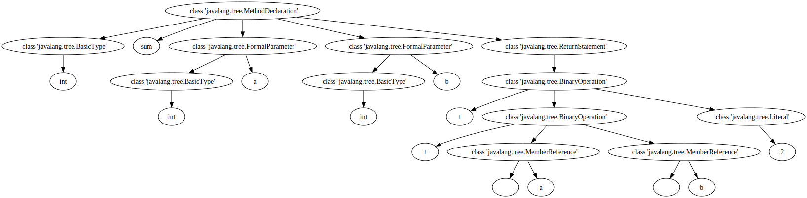

# Syntax-based Analysis (Part 2)

Disclaimer: This notebook is work in progress; explanations of the Code2vec and ASTNN models are still to be refined.

## Code Embeddings

In order to ing on to somewhat more classical examples of syntax-based analysis of code, we consider a recent trend: allow machine learning models to make predictions on code, we need to convert the source code to a format that is suitable as input for ML models, i.e., numerical vectors, typically referred to as _embeddings_. A common approach is to create these embeddings from the syntax tree.

A well-known example of embeddings in a different domain is Word2vec: Word2vec is a two-layer neural net that processes text by “vectorizing” words. Its input is a text corpus and its output is a set of vectors: feature vectors that represent words in that corpus. 

The purpose and usefulness of Word2vec is to group the vectors of similar words together in vectorspace. That is, it detects similarities mathematically. Word2vec creates vectors that are distributed numerical representations of word features, features such as the context of individual words.

Given enough data, usage and contexts, Word2vec can make highly accurate guesses about a word’s meaning based on past appearances. Those guesses can be used to establish a word’s association with other words (e.g. “man” is to “boy” what “woman” is to “girl”), or cluster documents and classify them by topic. Those clusters can form the basis of search, sentiment analysis and recommendations in such diverse fields as scientific research, legal discovery, e-commerce and customer relationship management.

The output of the Word2vec neural net is a vocabulary in which each item has a vector attached to it, which can be fed into a deep-learning net or simply queried to detect relationships between words.


```python
import gensim.downloader
glove_vectors = gensim.downloader.load('glove-twitter-25')
```


```python
glove_vectors.most_similar('twitter')
```


    [('facebook', 0.948005199432373),
     ('tweet', 0.9403423070907593),
     ('fb', 0.9342358708381653),
     ('instagram', 0.9104824066162109),
     ('chat', 0.8964965343475342),
     ('hashtag', 0.8885937333106995),
     ('tweets', 0.8878158330917358),
     ('tl', 0.8778461217880249),
     ('link', 0.877821147441864),
     ('internet', 0.8753896355628967)]


## Code2vec

A fundamental paper introducing the general idea of code embeddings is Code2Vec:

Alon, U., Zilberstein, M., Levy, O., & Yahav, E. (2019). code2vec: Learning distributed representations of code. Proceedings of the ACM on Programming Languages, 3(POPL), 1-29.

We will look at how to embed an individual method using code2vec. For this, let's define a simple helper function that gives us an AST rooted at a method declaration.


```python
code = """
public int sum(int a, int b) {
   return a + b + 2;
}
"""
```


```python
import javalang
```


```python
def parse_method(code):
    class_code = "class Dummy {\n" + code + "\n}";
    tokens = javalang.tokenizer.tokenize(class_code)
    parser = javalang.parser.Parser(tokens)
    ast = parser.parse()
    _, node = list(ast.filter(javalang.tree.MethodDeclaration))[0]
    return node
```


```python
tree = parse_method(code)
```


```python
tree
```


    MethodDeclaration(annotations=[], body=[ReturnStatement(expression=BinaryOperation(operandl=BinaryOperation(operandl=MemberReference(member=a, postfix_operators=[], prefix_operators=[], qualifier=, selectors=[]), operandr=MemberReference(member=b, postfix_operators=[], prefix_operators=[], qualifier=, selectors=[]), operator=+), operandr=Literal(postfix_operators=[], prefix_operators=[], qualifier=None, selectors=[], value=2), operator=+), label=None)], documentation=None, modifiers={'public'}, name=sum, parameters=[FormalParameter(annotations=[], modifiers=set(), name=a, type=BasicType(dimensions=[], name=int), varargs=False), FormalParameter(annotations=[], modifiers=set(), name=b, type=BasicType(dimensions=[], name=int), varargs=False)], return_type=BasicType(dimensions=[], name=int), throws=None, type_parameters=None)


```python
from graphviz import Digraph
def print_tree(tree):
    unique_id = 1
    dot = Digraph()
    for path, node in tree:
        dot.node(str(id(node)), str(type(node)))
        
        for child in node.children:
            if isinstance(child, javalang.ast.Node):
                dot.edge(str(id(node)), str(id(child)))
            elif type(child) == str:
                strid = str(unique_id)
                unique_id = unique_id + 1
                dot.node(strid, child)
                dot.edge(str(id(node)), strid)
            elif type(child) == list:
                for lc in child:
                    dot.edge(str(id(node)), str(id(lc)))
                 
    return dot
```


```python
print_tree(tree)
```


    

    


Code2vec looks at the concept of a path context, which is a path between two tokens in the AST.

We can easily retrieve a list of all terminals in the AST; for example we could traverse the tree and look for strings or sets.


```python
for path, node in tree:
    for child in node.children:
        if child:
            if type(child) is str:
                print("Terminal: ", child)
            elif type(child) is set:
                for x in child:
                    print("Terminal ", x)
        
        
```

    Terminal  public
    Terminal:  sum
    Terminal:  int
    Terminal:  a
    Terminal:  int
    Terminal:  b
    Terminal:  int
    Terminal:  +
    Terminal:  +
    Terminal:  a
    Terminal:  b
    Terminal:  2


Let's put this into a function that gives us the terminals as well as the corresponding AST nodes.


```python
def get_terminal_nodes(tree):
    for path, node in tree:
        for child in node.children:
            if child:
                if type(child) is str and child != "Dummy":
                    yield(node, child)
                elif type(child) is set:
                    for x in child:
                        yield(node, x)      
```


```python
[ terminal for _, terminal in list(get_terminal_nodes(tree))]
```


    ['public', 'sum', 'int', 'a', 'int', 'b', 'int', '+', '+', 'a', 'b', '2']


A path context is defined as the path between two terminals, so let's pick to two terminals.


```python
node1, terminal1 = list(get_terminal_nodes(tree))[-1]
node2, terminal2 = list(get_terminal_nodes(tree))[-2]
```


```python
terminal1
```


    '2'


```python
terminal2
```


    'b'


Let's first construct the path from a root node to a chosen terminal node.


```python
def get_path(tree, node):
    if tree == node:
        return [tree]
    
    if type(tree) == list:
        for child in tree:
            path = get_path(child, node)
            if path:
                return path  
    
    if not isinstance(tree, javalang.tree.Node):
        return None
    
    for child in tree.children:
        path = get_path(child, node)
        if path:
            return [tree] + path  
    
    return None
```


```python
def print_path(path):
    result = ""
    for node in path:
        if type(node) == str:
            result += node
        elif type(node) == list:
            result += print_path(node)
        else:
            result += str(type(node))

    return result
```


```python
print_path(get_path(tree, node1))
```


    "<class 'javalang.tree.MethodDeclaration'><class 'javalang.tree.ReturnStatement'><class 'javalang.tree.BinaryOperation'><class 'javalang.tree.Literal'>"


```python
print_path(get_path(tree, node2))
```


    "<class 'javalang.tree.MethodDeclaration'><class 'javalang.tree.ReturnStatement'><class 'javalang.tree.BinaryOperation'><class 'javalang.tree.BinaryOperation'><class 'javalang.tree.MemberReference'>"


A path context consists of the path up the AST from the first terminal node to the least common ancestor of both terminal nodes, and then down the AST again to the second terminal node.


```python
def path_context(tree, node1, node2):
    path1 = get_path(tree, node2)
    path1.reverse()
    for i in range(len(path1)):
        node = path1[i]
        path2 = get_path(node, node1)
        if path2:
            return (path1[:i], path2)
```


```python
def print_path_context(path_context):
    down_path = []
    up_path = []
    for node in path_context[0]:
        if type(node) == str:
            up_path.append(node)
        else:
            up_path.append(node.__class__.__name__)
    for node in path_context[1]:
        if type(node) == str:
            down_path.append(node)
        else:
            down_path.append(node.__class__.__name__)
            
    return "↑".join(up_path) + "↑" + "↓".join(down_path)
```


```python
print_path_context(path_context(tree, node1, node2))
```


    'MemberReference↑BinaryOperation↑BinaryOperation↓Literal'


```python
print_path_context(path_context(tree, node2, node1))
```


    'Literal↑BinaryOperation↓BinaryOperation↓MemberReference'


```python
terminal1
```


    '2'


```python
terminal2
```


    'b'


To build the embeddings for a method, we next require the path context for every pair of terminal nodes in the AST.


```python
terminals = list(get_terminal_nodes(tree))
paths = []
for index1 in range(len(terminals)-1):
    node1, terminal1 = terminals[index1]
    for index2 in range(index1 + 1, len(terminals)):
        node2, terminal2 = terminals[index2]
        path = path_context(tree, node1, node2)
        print(terminal1, ",", print_path_context(path), ",", terminal2)
        paths.append(path)
len(paths)
```

    public , ↑MethodDeclaration , sum
    public , BasicType↑MethodDeclaration , int
    public , FormalParameter↑MethodDeclaration , a
    public , BasicType↑FormalParameter↑MethodDeclaration , int
    public , FormalParameter↑MethodDeclaration , b
    public , BasicType↑FormalParameter↑MethodDeclaration , int
    public , BinaryOperation↑ReturnStatement↑MethodDeclaration , +
    public , BinaryOperation↑BinaryOperation↑ReturnStatement↑MethodDeclaration , +
    public , MemberReference↑BinaryOperation↑BinaryOperation↑ReturnStatement↑MethodDeclaration , a
    public , MemberReference↑BinaryOperation↑BinaryOperation↑ReturnStatement↑MethodDeclaration , b
    public , Literal↑BinaryOperation↑ReturnStatement↑MethodDeclaration , 2
    sum , BasicType↑MethodDeclaration , int
    sum , FormalParameter↑MethodDeclaration , a
    sum , BasicType↑FormalParameter↑MethodDeclaration , int
    sum , FormalParameter↑MethodDeclaration , b
    sum , BasicType↑FormalParameter↑MethodDeclaration , int
    sum , BinaryOperation↑ReturnStatement↑MethodDeclaration , +
    sum , BinaryOperation↑BinaryOperation↑ReturnStatement↑MethodDeclaration , +
    sum , MemberReference↑BinaryOperation↑BinaryOperation↑ReturnStatement↑MethodDeclaration , a
    sum , MemberReference↑BinaryOperation↑BinaryOperation↑ReturnStatement↑MethodDeclaration , b
    sum , Literal↑BinaryOperation↑ReturnStatement↑MethodDeclaration , 2
    int , FormalParameter↑MethodDeclaration↓BasicType , a
    int , BasicType↑FormalParameter↑MethodDeclaration↓BasicType , int
    int , FormalParameter↑MethodDeclaration↓BasicType , b
    int , BasicType↑FormalParameter↑MethodDeclaration↓BasicType , int
    int , BinaryOperation↑ReturnStatement↑MethodDeclaration↓BasicType , +
    int , BinaryOperation↑BinaryOperation↑ReturnStatement↑MethodDeclaration↓BasicType , +
    int , MemberReference↑BinaryOperation↑BinaryOperation↑ReturnStatement↑MethodDeclaration↓BasicType , a
    int , MemberReference↑BinaryOperation↑BinaryOperation↑ReturnStatement↑MethodDeclaration↓BasicType , b
    int , Literal↑BinaryOperation↑ReturnStatement↑MethodDeclaration↓BasicType , 2
    a , BasicType↑FormalParameter , int
    a , FormalParameter↑MethodDeclaration↓FormalParameter , b
    a , BasicType↑FormalParameter↑MethodDeclaration↓FormalParameter , int
    a , BinaryOperation↑ReturnStatement↑MethodDeclaration↓FormalParameter , +
    a , BinaryOperation↑BinaryOperation↑ReturnStatement↑MethodDeclaration↓FormalParameter , +
    a , MemberReference↑BinaryOperation↑BinaryOperation↑ReturnStatement↑MethodDeclaration↓FormalParameter , a
    a , MemberReference↑BinaryOperation↑BinaryOperation↑ReturnStatement↑MethodDeclaration↓FormalParameter , b
    a , Literal↑BinaryOperation↑ReturnStatement↑MethodDeclaration↓FormalParameter , 2
    int , FormalParameter↑MethodDeclaration↓FormalParameter↓BasicType , b
    int , BasicType↑FormalParameter↑MethodDeclaration↓FormalParameter↓BasicType , int
    int , BinaryOperation↑ReturnStatement↑MethodDeclaration↓FormalParameter↓BasicType , +
    int , BinaryOperation↑BinaryOperation↑ReturnStatement↑MethodDeclaration↓FormalParameter↓BasicType , +
    int , MemberReference↑BinaryOperation↑BinaryOperation↑ReturnStatement↑MethodDeclaration↓FormalParameter↓BasicType , a
    int , MemberReference↑BinaryOperation↑BinaryOperation↑ReturnStatement↑MethodDeclaration↓FormalParameter↓BasicType , b
    int , Literal↑BinaryOperation↑ReturnStatement↑MethodDeclaration↓FormalParameter↓BasicType , 2
    b , BasicType↑FormalParameter , int
    b , BinaryOperation↑ReturnStatement↑MethodDeclaration↓FormalParameter , +
    b , BinaryOperation↑BinaryOperation↑ReturnStatement↑MethodDeclaration↓FormalParameter , +
    b , MemberReference↑BinaryOperation↑BinaryOperation↑ReturnStatement↑MethodDeclaration↓FormalParameter , a
    b , MemberReference↑BinaryOperation↑BinaryOperation↑ReturnStatement↑MethodDeclaration↓FormalParameter , b
    b , Literal↑BinaryOperation↑ReturnStatement↑MethodDeclaration↓FormalParameter , 2
    int , BinaryOperation↑ReturnStatement↑MethodDeclaration↓FormalParameter↓BasicType , +
    int , BinaryOperation↑BinaryOperation↑ReturnStatement↑MethodDeclaration↓FormalParameter↓BasicType , +
    int , MemberReference↑BinaryOperation↑BinaryOperation↑ReturnStatement↑MethodDeclaration↓FormalParameter↓BasicType , a
    int , MemberReference↑BinaryOperation↑BinaryOperation↑ReturnStatement↑MethodDeclaration↓FormalParameter↓BasicType , b
    int , Literal↑BinaryOperation↑ReturnStatement↑MethodDeclaration↓FormalParameter↓BasicType , 2
    + , BinaryOperation↑BinaryOperation , +
    + , MemberReference↑BinaryOperation↑BinaryOperation , a
    + , MemberReference↑BinaryOperation↑BinaryOperation , b
    + , Literal↑BinaryOperation , 2
    + , MemberReference↑BinaryOperation , a
    + , MemberReference↑BinaryOperation , b
    + , Literal↑BinaryOperation↓BinaryOperation , 2
    a , MemberReference↑BinaryOperation↓MemberReference , b
    a , Literal↑BinaryOperation↓BinaryOperation↓MemberReference , 2
    b , Literal↑BinaryOperation↓BinaryOperation↓MemberReference , 2


    66


Converting a function to a path context


```python
method1 = """
public int sum(int a, int b) {
   return a + b + 2;
}
"""
```


```python
method2 = """
public void printHello(String name) {
   System.out.println("Hello " + name +"! ");
}
"""
```


```python
method3 = """
public boolean isTheAnswer(int x) {
   if (x == 42) {
     return true;
   } else {
     return false;
   }
}
"""
```


```python
def get_method_name(tree):
    for _, node in tree.filter(javalang.tree.MethodDeclaration):
        return node.name
    return None
```


```python
def get_id(value, dictionary, vocab):
    if value in dictionary:
        return dictionary[value]
    else:
        new_id = len(dictionary.keys())
        dictionary[value] = new_id
        vocab[new_id] = value
    return new_id
```


```python
from dataclasses import dataclass

# collection of all known paths, terminals, and method names in the dataset
@dataclass
class Vocabulary:
    # actual type of the value is not important, put in whatever is best
    paths: dict[int, str]
    terminals: dict[int, str]
    method_names: dict[int, str]

vocabulary = Vocabulary({}, {}, {})
```


```python
train_x = []
train_y = []

paths = {}
method_names = {}
terminal_names = {}

for method in [method1, method2, method3]:
    method_ast = parse_method(method)
    name = get_method_name(method_ast)    
    method_id = get_id(name, method_names, vocabulary.method_names)
    path_contexts = []
    
    terminals = list(get_terminal_nodes(method_ast))
    for index1 in range(len(terminals)-1):
        node1, terminal1 = terminals[index1]
        terminal1_id = get_id(terminal1, terminal_names, vocabulary.terminals)
        for index2 in range(index1 + 1, len(terminals)):
            node2, terminal2 = terminals[index2]
            terminal2_id = get_id(terminal2, terminal_names, vocabulary.terminals)
            path = path_context(method_ast, node1, node2)
            path_str = print_path_context(path)
            path_id = get_id(path_str, paths, vocabulary.paths)
            print(terminal1, ",", path_str, ",", terminal2)
            print(terminal1_id, ",", path_id, ",", terminal2_id)
            path_contexts.append((terminal1_id, path_id, terminal2_id))
            
    train_x.append(path_contexts)
    train_y.append(method_id)
```

    public , ↑MethodDeclaration , sum
    0 , 0 , 1
    public , BasicType↑MethodDeclaration , int
    0 , 1 , 2
    public , FormalParameter↑MethodDeclaration , a
    0 , 2 , 3
    public , BasicType↑FormalParameter↑MethodDeclaration , int
    0 , 3 , 2
    public , FormalParameter↑MethodDeclaration , b
    0 , 2 , 4
    public , BasicType↑FormalParameter↑MethodDeclaration , int
    0 , 3 , 2
    public , BinaryOperation↑ReturnStatement↑MethodDeclaration , +
    0 , 4 , 5
    public , BinaryOperation↑BinaryOperation↑ReturnStatement↑MethodDeclaration , +
    0 , 5 , 5
    public , MemberReference↑BinaryOperation↑BinaryOperation↑ReturnStatement↑MethodDeclaration , a
    0 , 6 , 3
    public , MemberReference↑BinaryOperation↑BinaryOperation↑ReturnStatement↑MethodDeclaration , b
    0 , 6 , 4
    public , Literal↑BinaryOperation↑ReturnStatement↑MethodDeclaration , 2
    0 , 7 , 6
    sum , BasicType↑MethodDeclaration , int
    1 , 1 , 2
    sum , FormalParameter↑MethodDeclaration , a
    1 , 2 , 3
    sum , BasicType↑FormalParameter↑MethodDeclaration , int
    1 , 3 , 2
    sum , FormalParameter↑MethodDeclaration , b
    1 , 2 , 4
    sum , BasicType↑FormalParameter↑MethodDeclaration , int
    1 , 3 , 2
    sum , BinaryOperation↑ReturnStatement↑MethodDeclaration , +
    1 , 4 , 5
    sum , BinaryOperation↑BinaryOperation↑ReturnStatement↑MethodDeclaration , +
    1 , 5 , 5
    sum , MemberReference↑BinaryOperation↑BinaryOperation↑ReturnStatement↑MethodDeclaration , a
    1 , 6 , 3
    sum , MemberReference↑BinaryOperation↑BinaryOperation↑ReturnStatement↑MethodDeclaration , b
    1 , 6 , 4
    sum , Literal↑BinaryOperation↑ReturnStatement↑MethodDeclaration , 2
    1 , 7 , 6
    int , FormalParameter↑MethodDeclaration↓BasicType , a
    2 , 8 , 3
    int , BasicType↑FormalParameter↑MethodDeclaration↓BasicType , int
    2 , 9 , 2
    int , FormalParameter↑MethodDeclaration↓BasicType , b
    2 , 8 , 4
    int , BasicType↑FormalParameter↑MethodDeclaration↓BasicType , int
    2 , 9 , 2
    int , BinaryOperation↑ReturnStatement↑MethodDeclaration↓BasicType , +
    2 , 10 , 5
    int , BinaryOperation↑BinaryOperation↑ReturnStatement↑MethodDeclaration↓BasicType , +
    2 , 11 , 5
    int , MemberReference↑BinaryOperation↑BinaryOperation↑ReturnStatement↑MethodDeclaration↓BasicType , a
    2 , 12 , 3
    int , MemberReference↑BinaryOperation↑BinaryOperation↑ReturnStatement↑MethodDeclaration↓BasicType , b
    2 , 12 , 4
    int , Literal↑BinaryOperation↑ReturnStatement↑MethodDeclaration↓BasicType , 2
    2 , 13 , 6
    a , BasicType↑FormalParameter , int
    3 , 14 , 2
    a , FormalParameter↑MethodDeclaration↓FormalParameter , b
    3 , 15 , 4
    a , BasicType↑FormalParameter↑MethodDeclaration↓FormalParameter , int
    3 , 16 , 2
    a , BinaryOperation↑ReturnStatement↑MethodDeclaration↓FormalParameter , +
    3 , 17 , 5
    a , BinaryOperation↑BinaryOperation↑ReturnStatement↑MethodDeclaration↓FormalParameter , +
    3 , 18 , 5
    a , MemberReference↑BinaryOperation↑BinaryOperation↑ReturnStatement↑MethodDeclaration↓FormalParameter , a
    3 , 19 , 3
    a , MemberReference↑BinaryOperation↑BinaryOperation↑ReturnStatement↑MethodDeclaration↓FormalParameter , b
    3 , 19 , 4
    a , Literal↑BinaryOperation↑ReturnStatement↑MethodDeclaration↓FormalParameter , 2
    3 , 20 , 6
    int , FormalParameter↑MethodDeclaration↓FormalParameter↓BasicType , b
    2 , 21 , 4
    int , BasicType↑FormalParameter↑MethodDeclaration↓FormalParameter↓BasicType , int
    2 , 22 , 2
    int , BinaryOperation↑ReturnStatement↑MethodDeclaration↓FormalParameter↓BasicType , +
    2 , 23 , 5
    int , BinaryOperation↑BinaryOperation↑ReturnStatement↑MethodDeclaration↓FormalParameter↓BasicType , +
    2 , 24 , 5
    int , MemberReference↑BinaryOperation↑BinaryOperation↑ReturnStatement↑MethodDeclaration↓FormalParameter↓BasicType , a
    2 , 25 , 3
    int , MemberReference↑BinaryOperation↑BinaryOperation↑ReturnStatement↑MethodDeclaration↓FormalParameter↓BasicType , b
    2 , 25 , 4
    int , Literal↑BinaryOperation↑ReturnStatement↑MethodDeclaration↓FormalParameter↓BasicType , 2
    2 , 26 , 6
    b , BasicType↑FormalParameter , int
    4 , 14 , 2
    b , BinaryOperation↑ReturnStatement↑MethodDeclaration↓FormalParameter , +
    4 , 17 , 5
    b , BinaryOperation↑BinaryOperation↑ReturnStatement↑MethodDeclaration↓FormalParameter , +
    4 , 18 , 5
    b , MemberReference↑BinaryOperation↑BinaryOperation↑ReturnStatement↑MethodDeclaration↓FormalParameter , a
    4 , 19 , 3
    b , MemberReference↑BinaryOperation↑BinaryOperation↑ReturnStatement↑MethodDeclaration↓FormalParameter , b
    4 , 19 , 4
    b , Literal↑BinaryOperation↑ReturnStatement↑MethodDeclaration↓FormalParameter , 2
    4 , 20 , 6
    int , BinaryOperation↑ReturnStatement↑MethodDeclaration↓FormalParameter↓BasicType , +
    2 , 23 , 5
    int , BinaryOperation↑BinaryOperation↑ReturnStatement↑MethodDeclaration↓FormalParameter↓BasicType , +
    2 , 24 , 5
    int , MemberReference↑BinaryOperation↑BinaryOperation↑ReturnStatement↑MethodDeclaration↓FormalParameter↓BasicType , a
    2 , 25 , 3
    int , MemberReference↑BinaryOperation↑BinaryOperation↑ReturnStatement↑MethodDeclaration↓FormalParameter↓BasicType , b
    2 , 25 , 4
    int , Literal↑BinaryOperation↑ReturnStatement↑MethodDeclaration↓FormalParameter↓BasicType , 2
    2 , 26 , 6
    + , BinaryOperation↑BinaryOperation , +
    5 , 27 , 5
    + , MemberReference↑BinaryOperation↑BinaryOperation , a
    5 , 28 , 3
    + , MemberReference↑BinaryOperation↑BinaryOperation , b
    5 , 28 , 4
    + , Literal↑BinaryOperation , 2
    5 , 29 , 6
    + , MemberReference↑BinaryOperation , a
    5 , 30 , 3
    + , MemberReference↑BinaryOperation , b
    5 , 30 , 4
    + , Literal↑BinaryOperation↓BinaryOperation , 2
    5 , 31 , 6
    a , MemberReference↑BinaryOperation↓MemberReference , b
    3 , 32 , 4
    a , Literal↑BinaryOperation↓BinaryOperation↓MemberReference , 2
    3 , 33 , 6
    b , Literal↑BinaryOperation↓BinaryOperation↓MemberReference , 2
    4 , 33 , 6
    public , ↑MethodDeclaration , printHello
    0 , 0 , 7
    public , FormalParameter↑MethodDeclaration , name
    0 , 2 , 8
    public , ReferenceType↑FormalParameter↑MethodDeclaration , String
    0 , 34 , 9
    public , MethodInvocation↑StatementExpression↑MethodDeclaration , System.out
    0 , 35 , 10
    public , MethodInvocation↑StatementExpression↑MethodDeclaration , println
    0 , 35 , 11
    public , BinaryOperation↑MethodInvocation↑StatementExpression↑MethodDeclaration , +
    0 , 36 , 5
    public , BinaryOperation↑BinaryOperation↑MethodInvocation↑StatementExpression↑MethodDeclaration , +
    0 , 37 , 5
    public , Literal↑BinaryOperation↑BinaryOperation↑MethodInvocation↑StatementExpression↑MethodDeclaration , "Hello "
    0 , 38 , 12
    public , MemberReference↑BinaryOperation↑BinaryOperation↑MethodInvocation↑StatementExpression↑MethodDeclaration , name
    0 , 39 , 8
    public , Literal↑BinaryOperation↑MethodInvocation↑StatementExpression↑MethodDeclaration , "! "
    0 , 40 , 13
    printHello , FormalParameter↑MethodDeclaration , name
    7 , 2 , 8
    printHello , ReferenceType↑FormalParameter↑MethodDeclaration , String
    7 , 34 , 9
    printHello , MethodInvocation↑StatementExpression↑MethodDeclaration , System.out
    7 , 35 , 10
    printHello , MethodInvocation↑StatementExpression↑MethodDeclaration , println
    7 , 35 , 11
    printHello , BinaryOperation↑MethodInvocation↑StatementExpression↑MethodDeclaration , +
    7 , 36 , 5
    printHello , BinaryOperation↑BinaryOperation↑MethodInvocation↑StatementExpression↑MethodDeclaration , +
    7 , 37 , 5
    printHello , Literal↑BinaryOperation↑BinaryOperation↑MethodInvocation↑StatementExpression↑MethodDeclaration , "Hello "
    7 , 38 , 12
    printHello , MemberReference↑BinaryOperation↑BinaryOperation↑MethodInvocation↑StatementExpression↑MethodDeclaration , name
    7 , 39 , 8
    printHello , Literal↑BinaryOperation↑MethodInvocation↑StatementExpression↑MethodDeclaration , "! "
    7 , 40 , 13
    name , ReferenceType↑FormalParameter , String
    8 , 41 , 9
    name , MethodInvocation↑StatementExpression↑MethodDeclaration↓FormalParameter , System.out
    8 , 42 , 10
    name , MethodInvocation↑StatementExpression↑MethodDeclaration↓FormalParameter , println
    8 , 42 , 11
    name , BinaryOperation↑MethodInvocation↑StatementExpression↑MethodDeclaration↓FormalParameter , +
    8 , 43 , 5
    name , BinaryOperation↑BinaryOperation↑MethodInvocation↑StatementExpression↑MethodDeclaration↓FormalParameter , +
    8 , 44 , 5
    name , Literal↑BinaryOperation↑BinaryOperation↑MethodInvocation↑StatementExpression↑MethodDeclaration↓FormalParameter , "Hello "
    8 , 45 , 12
    name , MemberReference↑BinaryOperation↑BinaryOperation↑MethodInvocation↑StatementExpression↑MethodDeclaration↓FormalParameter , name
    8 , 46 , 8
    name , Literal↑BinaryOperation↑MethodInvocation↑StatementExpression↑MethodDeclaration↓FormalParameter , "! "
    8 , 47 , 13
    String , MethodInvocation↑StatementExpression↑MethodDeclaration↓FormalParameter↓ReferenceType , System.out
    9 , 48 , 10
    String , MethodInvocation↑StatementExpression↑MethodDeclaration↓FormalParameter↓ReferenceType , println
    9 , 48 , 11
    String , BinaryOperation↑MethodInvocation↑StatementExpression↑MethodDeclaration↓FormalParameter↓ReferenceType , +
    9 , 49 , 5
    String , BinaryOperation↑BinaryOperation↑MethodInvocation↑StatementExpression↑MethodDeclaration↓FormalParameter↓ReferenceType , +
    9 , 50 , 5
    String , Literal↑BinaryOperation↑BinaryOperation↑MethodInvocation↑StatementExpression↑MethodDeclaration↓FormalParameter↓ReferenceType , "Hello "
    9 , 51 , 12
    String , MemberReference↑BinaryOperation↑BinaryOperation↑MethodInvocation↑StatementExpression↑MethodDeclaration↓FormalParameter↓ReferenceType , name
    9 , 52 , 8
    String , Literal↑BinaryOperation↑MethodInvocation↑StatementExpression↑MethodDeclaration↓FormalParameter↓ReferenceType , "! "
    9 , 53 , 13
    System.out , ↑MethodInvocation , println
    10 , 54 , 11
    System.out , BinaryOperation↑MethodInvocation , +
    10 , 55 , 5
    System.out , BinaryOperation↑BinaryOperation↑MethodInvocation , +
    10 , 56 , 5
    System.out , Literal↑BinaryOperation↑BinaryOperation↑MethodInvocation , "Hello "
    10 , 57 , 12
    System.out , MemberReference↑BinaryOperation↑BinaryOperation↑MethodInvocation , name
    10 , 58 , 8
    System.out , Literal↑BinaryOperation↑MethodInvocation , "! "
    10 , 59 , 13
    println , BinaryOperation↑MethodInvocation , +
    11 , 55 , 5
    println , BinaryOperation↑BinaryOperation↑MethodInvocation , +
    11 , 56 , 5
    println , Literal↑BinaryOperation↑BinaryOperation↑MethodInvocation , "Hello "
    11 , 57 , 12
    println , MemberReference↑BinaryOperation↑BinaryOperation↑MethodInvocation , name
    11 , 58 , 8
    println , Literal↑BinaryOperation↑MethodInvocation , "! "
    11 , 59 , 13
    + , BinaryOperation↑BinaryOperation , +
    5 , 27 , 5
    + , Literal↑BinaryOperation↑BinaryOperation , "Hello "
    5 , 60 , 12
    + , MemberReference↑BinaryOperation↑BinaryOperation , name
    5 , 28 , 8
    + , Literal↑BinaryOperation , "! "
    5 , 29 , 13
    + , Literal↑BinaryOperation , "Hello "
    5 , 29 , 12
    + , MemberReference↑BinaryOperation , name
    5 , 30 , 8
    + , Literal↑BinaryOperation↓BinaryOperation , "! "
    5 , 31 , 13
    "Hello " , MemberReference↑BinaryOperation↓Literal , name
    12 , 61 , 8
    "Hello " , Literal↑BinaryOperation↓BinaryOperation↓Literal , "! "
    12 , 62 , 13
    name , Literal↑BinaryOperation↓BinaryOperation↓MemberReference , "! "
    8 , 33 , 13
    public , ↑MethodDeclaration , isTheAnswer
    0 , 0 , 14
    public , BasicType↑MethodDeclaration , boolean
    0 , 1 , 15
    public , FormalParameter↑MethodDeclaration , x
    0 , 2 , 16
    public , BasicType↑FormalParameter↑MethodDeclaration , int
    0 , 3 , 2
    public , BinaryOperation↑IfStatement↑MethodDeclaration , ==
    0 , 63 , 17
    public , MemberReference↑BinaryOperation↑IfStatement↑MethodDeclaration , x
    0 , 64 , 16
    public , Literal↑BinaryOperation↑IfStatement↑MethodDeclaration , 42
    0 , 65 , 18
    public , Literal↑ReturnStatement↑BlockStatement↑IfStatement↑MethodDeclaration , true
    0 , 66 , 19
    public , Literal↑ReturnStatement↑BlockStatement↑IfStatement↑MethodDeclaration , false
    0 , 66 , 20
    isTheAnswer , BasicType↑MethodDeclaration , boolean
    14 , 1 , 15
    isTheAnswer , FormalParameter↑MethodDeclaration , x
    14 , 2 , 16
    isTheAnswer , BasicType↑FormalParameter↑MethodDeclaration , int
    14 , 3 , 2
    isTheAnswer , BinaryOperation↑IfStatement↑MethodDeclaration , ==
    14 , 63 , 17
    isTheAnswer , MemberReference↑BinaryOperation↑IfStatement↑MethodDeclaration , x
    14 , 64 , 16
    isTheAnswer , Literal↑BinaryOperation↑IfStatement↑MethodDeclaration , 42
    14 , 65 , 18
    isTheAnswer , Literal↑ReturnStatement↑BlockStatement↑IfStatement↑MethodDeclaration , true
    14 , 66 , 19
    isTheAnswer , Literal↑ReturnStatement↑BlockStatement↑IfStatement↑MethodDeclaration , false
    14 , 66 , 20
    boolean , FormalParameter↑MethodDeclaration↓BasicType , x
    15 , 8 , 16
    boolean , BasicType↑FormalParameter↑MethodDeclaration↓BasicType , int
    15 , 9 , 2
    boolean , BinaryOperation↑IfStatement↑MethodDeclaration↓BasicType , ==
    15 , 67 , 17
    boolean , MemberReference↑BinaryOperation↑IfStatement↑MethodDeclaration↓BasicType , x
    15 , 68 , 16
    boolean , Literal↑BinaryOperation↑IfStatement↑MethodDeclaration↓BasicType , 42
    15 , 69 , 18
    boolean , Literal↑ReturnStatement↑BlockStatement↑IfStatement↑MethodDeclaration↓BasicType , true
    15 , 70 , 19
    boolean , Literal↑ReturnStatement↑BlockStatement↑IfStatement↑MethodDeclaration↓BasicType , false
    15 , 70 , 20
    x , BasicType↑FormalParameter , int
    16 , 14 , 2
    x , BinaryOperation↑IfStatement↑MethodDeclaration↓FormalParameter , ==
    16 , 71 , 17
    x , MemberReference↑BinaryOperation↑IfStatement↑MethodDeclaration↓FormalParameter , x
    16 , 72 , 16
    x , Literal↑BinaryOperation↑IfStatement↑MethodDeclaration↓FormalParameter , 42
    16 , 73 , 18
    x , Literal↑ReturnStatement↑BlockStatement↑IfStatement↑MethodDeclaration↓FormalParameter , true
    16 , 74 , 19
    x , Literal↑ReturnStatement↑BlockStatement↑IfStatement↑MethodDeclaration↓FormalParameter , false
    16 , 74 , 20
    int , BinaryOperation↑IfStatement↑MethodDeclaration↓FormalParameter↓BasicType , ==
    2 , 75 , 17
    int , MemberReference↑BinaryOperation↑IfStatement↑MethodDeclaration↓FormalParameter↓BasicType , x
    2 , 76 , 16
    int , Literal↑BinaryOperation↑IfStatement↑MethodDeclaration↓FormalParameter↓BasicType , 42
    2 , 77 , 18
    int , Literal↑ReturnStatement↑BlockStatement↑IfStatement↑MethodDeclaration↓FormalParameter↓BasicType , true
    2 , 78 , 19
    int , Literal↑ReturnStatement↑BlockStatement↑IfStatement↑MethodDeclaration↓FormalParameter↓BasicType , false
    2 , 78 , 20
    == , MemberReference↑BinaryOperation , x
    17 , 30 , 16
    == , Literal↑BinaryOperation , 42
    17 , 29 , 18
    == , Literal↑ReturnStatement↑BlockStatement↑IfStatement↓BinaryOperation , true
    17 , 79 , 19
    == , Literal↑ReturnStatement↑BlockStatement↑IfStatement↓BinaryOperation , false
    17 , 79 , 20
    x , Literal↑BinaryOperation↓MemberReference , 42
    16 , 80 , 18
    x , Literal↑ReturnStatement↑BlockStatement↑IfStatement↓BinaryOperation↓MemberReference , true
    16 , 81 , 19
    x , Literal↑ReturnStatement↑BlockStatement↑IfStatement↓BinaryOperation↓MemberReference , false
    16 , 81 , 20
    42 , Literal↑ReturnStatement↑BlockStatement↑IfStatement↓BinaryOperation↓Literal , true
    18 , 82 , 19
    42 , Literal↑ReturnStatement↑BlockStatement↑IfStatement↓BinaryOperation↓Literal , false
    18 , 82 , 20
    true , Literal↑ReturnStatement↑BlockStatement↑IfStatement↓BlockStatement↓ReturnStatement↓Literal , false
    19 , 83 , 20


```python
train_x
```


    [[(0, 0, 1),
      (0, 1, 2),
      (0, 2, 3),
      (0, 3, 2),
      (0, 2, 4),
      (0, 3, 2),
      (0, 4, 5),
      (0, 5, 5),
      (0, 6, 3),
      (0, 6, 4),
      (0, 7, 6),
      (1, 1, 2),
      (1, 2, 3),
      (1, 3, 2),
      (1, 2, 4),
      (1, 3, 2),
      (1, 4, 5),
      (1, 5, 5),
      (1, 6, 3),
      (1, 6, 4),
      (1, 7, 6),
      (2, 8, 3),
      (2, 9, 2),
      (2, 8, 4),
      (2, 9, 2),
      (2, 10, 5),
      (2, 11, 5),
      (2, 12, 3),
      (2, 12, 4),
      (2, 13, 6),
      (3, 14, 2),
      (3, 15, 4),
      (3, 16, 2),
      (3, 17, 5),
      (3, 18, 5),
      (3, 19, 3),
      (3, 19, 4),
      (3, 20, 6),
      (2, 21, 4),
      (2, 22, 2),
      (2, 23, 5),
      (2, 24, 5),
      (2, 25, 3),
      (2, 25, 4),
      (2, 26, 6),
      (4, 14, 2),
      (4, 17, 5),
      (4, 18, 5),
      (4, 19, 3),
      (4, 19, 4),
      (4, 20, 6),
      (2, 23, 5),
      (2, 24, 5),
      (2, 25, 3),
      (2, 25, 4),
      (2, 26, 6),
      (5, 27, 5),
      (5, 28, 3),
      (5, 28, 4),
      (5, 29, 6),
      (5, 30, 3),
      (5, 30, 4),
      (5, 31, 6),
      (3, 32, 4),
      (3, 33, 6),
      (4, 33, 6)],
     [(0, 0, 7),
      (0, 2, 8),
      (0, 34, 9),
      (0, 35, 10),
      (0, 35, 11),
      (0, 36, 5),
      (0, 37, 5),
      (0, 38, 12),
      (0, 39, 8),
      (0, 40, 13),
      (7, 2, 8),
      (7, 34, 9),
      (7, 35, 10),
      (7, 35, 11),
      (7, 36, 5),
      (7, 37, 5),
      (7, 38, 12),
      (7, 39, 8),
      (7, 40, 13),
      (8, 41, 9),
      (8, 42, 10),
      (8, 42, 11),
      (8, 43, 5),
      (8, 44, 5),
      (8, 45, 12),
      (8, 46, 8),
      (8, 47, 13),
      (9, 48, 10),
      (9, 48, 11),
      (9, 49, 5),
      (9, 50, 5),
      (9, 51, 12),
      (9, 52, 8),
      (9, 53, 13),
      (10, 54, 11),
      (10, 55, 5),
      (10, 56, 5),
      (10, 57, 12),
      (10, 58, 8),
      (10, 59, 13),
      (11, 55, 5),
      (11, 56, 5),
      (11, 57, 12),
      (11, 58, 8),
      (11, 59, 13),
      (5, 27, 5),
      (5, 60, 12),
      (5, 28, 8),
      (5, 29, 13),
      (5, 29, 12),
      (5, 30, 8),
      (5, 31, 13),
      (12, 61, 8),
      (12, 62, 13),
      (8, 33, 13)],
     [(0, 0, 14),
      (0, 1, 15),
      (0, 2, 16),
      (0, 3, 2),
      (0, 63, 17),
      (0, 64, 16),
      (0, 65, 18),
      (0, 66, 19),
      (0, 66, 20),
      (14, 1, 15),
      (14, 2, 16),
      (14, 3, 2),
      (14, 63, 17),
      (14, 64, 16),
      (14, 65, 18),
      (14, 66, 19),
      (14, 66, 20),
      (15, 8, 16),
      (15, 9, 2),
      (15, 67, 17),
      (15, 68, 16),
      (15, 69, 18),
      (15, 70, 19),
      (15, 70, 20),
      (16, 14, 2),
      (16, 71, 17),
      (16, 72, 16),
      (16, 73, 18),
      (16, 74, 19),
      (16, 74, 20),
      (2, 75, 17),
      (2, 76, 16),
      (2, 77, 18),
      (2, 78, 19),
      (2, 78, 20),
      (17, 30, 16),
      (17, 29, 18),
      (17, 79, 19),
      (17, 79, 20),
      (16, 80, 18),
      (16, 81, 19),
      (16, 81, 20),
      (18, 82, 19),
      (18, 82, 20),
      (19, 83, 20)]]


```python
train_y
```


    [0, 1, 2]


### Embedding Path Contexts

With a method represented as a bag of path contexts, where each context is represented as a vector of learned values. Before being able to feed this into a neural network, we need to create a single vector for a method. Code2vec achieves this by creating a weighted average context vector, where the weights are based on a global attention vector that is learned using standard neural backpropagation.

Since the aim of this course lies in the software analysis we won't go into much details on the machine learning side of things, but at this point I'd suggest that you read the following paper to get a great overview: [Code2vec Paper](https://urialon.cswp.cs.technion.ac.il/wp-content/uploads/sites/83/2018/12/code2vec-popl19.pdf).

Also, make sure to try out code embeddings at the [Code2vec interactive demo](https://code2vec.org).

 (Taken from the Code2vec paper).

In the following you can find the relevant code to create the model, but I won't go into much depth to explain this in detail.

### Representation
Each path is represented as a vector $p$ with values that are not known initially. The terminals are each represented by a vector $t$ with unknown elements as well. By concatenating the three parts of a context its representation $c_i = [t_\mathrm{start}, p, t_\mathrm{end}]$ is created.
To learn how the different parts of $c_i$ relate to each other, a weight matrix $W$ with learnable weights is introduced. The product $\tilde{c}_i := \mathrm{tanh}(W \cdot c_i)$ is then called a *combined context vector* as it now no longer contains just the concatenation of the three separate parts.

The whole code snippet/method body is again represented as a single vector $v$. As different contexts of this code snippet are not equally important, the network has to learn which ones actually are. To achieve this, an attention vector that contains a weight $\alpha_i$ for each context is learned. The code vector $v$ can then be calculated as the weighted sum
$$
    v := \sum_{i=1}^{n} \alpha_i \cdot \tilde{c}_i
$$


Each method name is again represented as a vector $y$ with unknown values. The probability $q(y)$ that a code vector should be associated with this tag is calculated as $q(y) := \mathrm{softmax}(v^T \cdot y)$. By performing this calculation for all known tags the one with the highest probability to fit the code can be chosen.

### Learned Elements
- A vector $c$ as representation for each context as combination of representations $p$ for paths and $t$ for terminals.
- A weight matrix $W$ that contains information how the three parts of a context are combined.
- An attention weight $\alpha$ which contains information which contexts in a method are important.
- A vector $t$ as representation for each method name.


```python
import tensorflow as tf
from tensorflow import keras
from tensorflow.python.layers.base import Layer
from keras import Input, activations, optimizers, losses
import keras.backend as kb
from keras.layers import Embedding, Concatenate, Dropout, TimeDistributed, Dense

# how many paths does the biggest analysed function have
MAX_PATHS = 50
# length of the vectors that should represent paths and labels (same size for simplicity)
EMBEDDING_SIZE = 100
# embedding sizes of start, path, end added together
CONTEXT_EMBEDDING_SIZE = 3 * EMBEDDING_SIZE
```


```python
# Adapted from: https://github.com/tech-srl/code2vec/blob/master/keras_model.py
def build_code2vec_model(vocab: Vocabulary):
    path_start_token = Input((MAX_PATHS,), dtype=tf.int32)
    path_input = Input((MAX_PATHS,), dtype=tf.int32)
    path_end_token = Input((MAX_PATHS,), dtype=tf.int32)
    # the sets of contexts for each function are padded to contain MAX_PATHS number of paths
    context_mask = Input((MAX_PATHS,))

    # The elements of the matrix are chosen randomly, as the actual values have to be learned.
    paths_embedded = Embedding(len(vocab.paths), EMBEDDING_SIZE,
                               name='path_embedding')(path_input)

    # Embed terminals the same way as paths.
    token_embedding = Embedding(len(vocab.terminals), EMBEDDING_SIZE,
                                name='token_embedding')
    path_start_token_embedded = token_embedding(path_start_token)
    path_end_token_embedded = token_embedding(path_end_token)

    # Representation of contexts $c_i$: concatenation of start, path, end
    context_embedded = Concatenate()([path_start_token_embedded, paths_embedded, path_end_token_embedded])
    # Dropout to prevent overfitting.
    context_embedded = Dropout(0.25)(context_embedded)

    # $\tilde{c}_i = tanh(Wc_i)$
    # Fully connected layer that learns to combine the three parts of a context.
    context_after_dense = TimeDistributed(
        Dense(CONTEXT_EMBEDDING_SIZE, use_bias=False,
              activation=activations.tanh))(context_embedded)

    # AttentionLayer learns which path contexts are the most important.
    # A code_vector $v$ now is the final representation for a piece of code.
    code_vectors, attention_weights = AttentionLayer(name='attention')([context_after_dense, context_mask])

    # $q(y) := softmax(v^T y)$
    # Final dense layer: Learn how the method names should be represented.
    # For each method name: The probability that a given code vector represents a method name is
    # the dot product of those two values after softmax normalisation.
    # The target_index is the key of the method name in the vocabulary with the highest probability.
    target_index = Dense(len(vocab.method_names), use_bias=False,
                         activation=activations.softmax, name='target_index')(
        code_vectors)

    inputs = [path_start_token, path_input, path_end_token, context_mask]
    outputs = [target_index]
    return keras.Model(name='code2vec', inputs=inputs, outputs=outputs)
```


```python
# Learns which of the contexts in the method are the most important.
#
# Adapted from: https://github.com/tech-srl/code2vec/blob/master/keras_attention_layer.py
class AttentionLayer(Layer):
    def __init__(self, **kwargs):
        super().__init__(**kwargs)

    def build(self, inputs_shape):
        shape_actual_input = inputs_shape[0]
        self.input_length = int(shape_actual_input[1])
        self.input_dim = int(shape_actual_input[2])

        # The vector that defines how much each context should be weighted.
        # Initialized with random values, model learns the actual ones.
        attention_param_shape = (self.input_dim, 1)
        self.attention_param = self.add_weight(name='attention_param',
                                               shape=attention_param_shape,
                                               initializer='uniform',
                                               trainable=True, dtype=tf.float32)

        super(AttentionLayer, self).build(shape_actual_input)

    def call(self, inputs, **kwargs):
        context = inputs[0]
        mask = inputs[1]

        # multiply each context with the attention to get the weight it should have in the final code_vector
        attention_weights = kb.dot(context, self.attention_param)

        if len(mask.shape) == 2:
            mask = kb.expand_dims(mask, axis=2)
        mask = kb.log(mask)
        attention_weights += mask

        # normalise weights
        attention_weights = kb.softmax(attention_weights, axis=1)
        # the code vector is just a weighted sum of contexts
        code_vector = kb.sum(context * attention_weights, axis=1)

        return code_vector, attention_weights

    def compute_output_shape(self, input_shape):
        return input_shape[0], input_shape[2]
```


```python
model = build_code2vec_model(vocabulary)
model.summary()
```

    Model: "code2vec"
    __________________________________________________________________________________________________
     Layer (type)                   Output Shape         Param #     Connected to                     
    ==================================================================================================
     input_1 (InputLayer)           [(None, 50)]         0           []                               
                                                                                                      
     input_2 (InputLayer)           [(None, 50)]         0           []                               
                                                                                                      
     input_3 (InputLayer)           [(None, 50)]         0           []                               
                                                                                                      
     token_embedding (Embedding)    (None, 50, 100)      2100        ['input_1[0][0]',                
                                                                      'input_3[0][0]']                
                                                                                                      
     path_embedding (Embedding)     (None, 50, 100)      8400        ['input_2[0][0]']                
                                                                                                      
     concatenate (Concatenate)      (None, 50, 300)      0           ['token_embedding[0][0]',        
                                                                      'path_embedding[0][0]',         
                                                                      'token_embedding[1][0]']        
                                                                                                      
     dropout (Dropout)              (None, 50, 300)      0           ['concatenate[0][0]']            
                                                                                                      
     time_distributed (TimeDistribu  (None, 50, 300)     90000       ['dropout[0][0]']                
     ted)                                                                                             
                                                                                                      
     tf.reshape (TFOpLambda)        (None, 300)          0           ['time_distributed[0][0]']       
                                                                                                      
     tf.compat.v1.shape (TFOpLambda  (3,)                0           ['time_distributed[0][0]']       
     )                                                                                                
                                                                                                      
     input_4 (InputLayer)           [(None, 50)]         0           []                               
                                                                                                      
     tf.linalg.matmul (TFOpLambda)  (None, 1)            0           ['tf.reshape[0][0]']             
                                                                                                      
     tf.unstack (TFOpLambda)        [(),                 0           ['tf.compat.v1.shape[0][0]']     
                                     (),                                                              
                                     ()]                                                              
                                                                                                      
     tf.expand_dims (TFOpLambda)    (None, 50, 1)        0           ['input_4[0][0]']                
                                                                                                      
     tf.reshape_1 (TFOpLambda)      (None, 50, 1)        0           ['tf.linalg.matmul[0][0]',       
                                                                      'tf.unstack[0][0]']             
                                                                                                      
     tf.math.log (TFOpLambda)       (None, 50, 1)        0           ['tf.expand_dims[0][0]']         
                                                                                                      
     tf.__operators__.add (TFOpLamb  (None, 50, 1)       0           ['tf.reshape_1[0][0]',           
     da)                                                              'tf.math.log[0][0]']            
                                                                                                      
     tf.nn.softmax (TFOpLambda)     (None, 50, 1)        0           ['tf.__operators__.add[0][0]']   
                                                                                                      
     tf.math.multiply (TFOpLambda)  (None, 50, 300)      0           ['time_distributed[0][0]',       
                                                                      'tf.nn.softmax[0][0]']          
                                                                                                      
     tf.math.reduce_sum (TFOpLambda  (None, 300)         0           ['tf.math.multiply[0][0]']       
     )                                                                                                
                                                                                                      
     target_index (Dense)           (None, 3)            900         ['tf.math.reduce_sum[0][0]']     
                                                                                                      
    ==================================================================================================
    Total params: 101,400
    Trainable params: 101,400
    Non-trainable params: 0
    __________________________________________________________________________________________________


```python
model.compile(optimizer=optimizers.Adam(), loss=losses.CategoricalCrossentropy())

# TODO: model.fit
```

# ASTNN

Recent work provides the strong evidence that syntactic knowledge contributes more in modeling source code
and can obtain better representation than traditional token-based methods. We will consider one example approach to creating code embeddings from syntactic information, ASTNN:

Zhang, J., Wang, X., Zhang, H., Sun, H., Wang, K., & Liu, X. (2019, May). A novel neural source code representation based on abstract syntax tree. In 2019 IEEE/ACM 41st International Conference on Software Engineering (ICSE) (pp. 783-794). IEEE.

ASTNN splits the large AST of one code fragment into a set of small trees at the statement level and performs tree-based neural embeddings on all statement trees. Recurrent Neural Networks (RNNs) are used to encode statements and the sequential dependency between the statements into a vector. These vectors capture the naturalness of source code, and can serve as a neural source code representation.


As an example application for these embeddings, we can once again use code clone detection, which boils down to the following:

- Compute vector embeddings $e_1$, $e_2 \in \mathbb{R}^m$ for two code snippets
- The distance between the code snippets is $r = |e_1 - e_2| \in \mathbb{R}^m$
- This can be reduced to a clone probability using a linear layer with sigmoid activation function $p = \textrm{sigmoid}(r) \in [0,1]$

## Preprocessing

The first step in producing the code embeddings consists of parsing the code, transforming the AST into a sequence of statement trees, and then replacing string labels of the tree nodes with numeric indices.

We will eventually apply our encoding to a dataset of C programs (using the model trained by the authors of ASTNN), so in the following we will consider the syntax trees of C programs created by Python's C Parser library: [PyCParser](https://github.com/eliben/pycparser)


```python
code = """
int foo() {}

int main(int argc, char** argv) {
  if (argc > 0) {
      foo();
  }
  return 0;
}
"""
```


```python
import pycparser
code_parser = pycparser.c_parser.CParser()

ast = code_parser.parse(code)
ast
```


    FileAST(ext=[FuncDef(decl=Decl(name='foo',
                                   quals=[
                                         ],
                                   align=[
                                         ],
                                   storage=[
                                           ],
                                   funcspec=[
                                            ],
                                   type=FuncDecl(args=None,
                                                 type=TypeDecl(declname='foo',
                                                               quals=[
                                                                     ],
                                                               align=None,
                                                               type=IdentifierType(names=['int'
                                                                                         ]
                                                                                   )
                                                               )
                                                 ),
                                   init=None,
                                   bitsize=None
                                   ),
                         param_decls=None,
                         body=Compound(block_items=None
                                       )
                         ),
                 FuncDef(decl=Decl(name='main',
                                   quals=[
                                         ],
                                   align=[
                                         ],
                                   storage=[
                                           ],
                                   funcspec=[
                                            ],
                                   type=FuncDecl(args=ParamList(params=[Decl(name='argc',
                                                                             quals=[
                                                                                   ],
                                                                             align=[
                                                                                   ],
                                                                             storage=[
                                                                                     ],
                                                                             funcspec=[
                                                                                      ],
                                                                             type=TypeDecl(declname='argc',
                                                                                           quals=[
                                                                                                 ],
                                                                                           align=None,
                                                                                           type=IdentifierType(names=['int'
                                                                                                                     ]
                                                                                                               )
                                                                                           ),
                                                                             init=None,
                                                                             bitsize=None
                                                                             ),
                                                                        Decl(name='argv',
                                                                             quals=[
                                                                                   ],
                                                                             align=[
                                                                                   ],
                                                                             storage=[
                                                                                     ],
                                                                             funcspec=[
                                                                                      ],
                                                                             type=PtrDecl(quals=[
                                                                                                ],
                                                                                          type=PtrDecl(quals=[
                                                                                                             ],
                                                                                                       type=TypeDecl(declname='argv',
                                                                                                                     quals=[
                                                                                                                           ],
                                                                                                                     align=None,
                                                                                                                     type=IdentifierType(names=['char'
                                                                                                                                               ]
                                                                                                                                         )
                                                                                                                     )
                                                                                                       )
                                                                                          ),
                                                                             init=None,
                                                                             bitsize=None
                                                                             )
                                                                       ]
                                                                ),
                                                 type=TypeDecl(declname='main',
                                                               quals=[
                                                                     ],
                                                               align=None,
                                                               type=IdentifierType(names=['int'
                                                                                         ]
                                                                                   )
                                                               )
                                                 ),
                                   init=None,
                                   bitsize=None
                                   ),
                         param_decls=None,
                         body=Compound(block_items=[If(cond=BinaryOp(op='>',
                                                                     left=ID(name='argc'
                                                                             ),
                                                                     right=Constant(type='int',
                                                                                    value='0'
                                                                                    )
                                                                     ),
                                                       iftrue=Compound(block_items=[FuncCall(name=ID(name='foo'
                                                                                                     ),
                                                                                             args=None
                                                                                             )
                                                                                   ]
                                                                       ),
                                                       iffalse=None
                                                       ),
                                                    Return(expr=Constant(type='int',
                                                                         value='0'
                                                                         )
                                                           )
                                                   ]
                                       )
                         )
                ]
            )


At the core of the ASTNN lies the extraction of statement trees from the AST. A statement tree is essentially a substree of the AST for a statement-node, and the list of statement trees is achieved by a preorder traversal of the AST.


```python
def get_statements(node):
    name = node.__class__.__name__
    print(f"Current node: {name}")
    for _, child in node.children():
        get_statements(child)
    
get_statements(ast)
```

    Current node: FileAST
    Current node: FuncDef
    Current node: Decl
    Current node: FuncDecl
    Current node: TypeDecl
    Current node: IdentifierType
    Current node: Compound
    Current node: FuncDef
    Current node: Decl
    Current node: FuncDecl
    Current node: ParamList
    Current node: Decl
    Current node: TypeDecl
    Current node: IdentifierType
    Current node: Decl
    Current node: PtrDecl
    Current node: PtrDecl
    Current node: TypeDecl
    Current node: IdentifierType
    Current node: TypeDecl
    Current node: IdentifierType
    Current node: Compound
    Current node: If
    Current node: BinaryOp
    Current node: ID
    Current node: Constant
    Current node: Compound
    Current node: FuncCall
    Current node: ID
    Current node: Return
    Current node: Constant


For our example program, we would like to create statement trees for the if statement (`If`), the function call (`FuncCall`) , and the return statement (`Return`). ASTNN also treats function declarations (`FuncDef`) as special statement nodes.


```python
def get_statements(node):
    name = node.__class__.__name__
    if name in ["FuncDef", "FuncCall", "If", "Return"]:
        print(f"Statement node: {name}")
    for _, child in node.children():
        get_statements(child)
    
get_statements(ast)
```

    Statement node: FuncDef
    Statement node: FuncDef
    Statement node: If
    Statement node: FuncCall
    Statement node: Return


A statement tree (ST-tree) rooted by the statement node $s \in S$ is the tree consisting of node s and all of
its descendants, but excluding any statements nodes. For example, for a method call statement, all child nodes are in the statement tree, since none of the children are statements. On the other hand, an if-statement consists of an expression as well as the conditionally executed statements:


```python
code_parser.parse("int main() {if (42 > 0) { foo(); } }")
```


    FileAST(ext=[FuncDef(decl=Decl(name='main',
                                   quals=[
                                         ],
                                   align=[
                                         ],
                                   storage=[
                                           ],
                                   funcspec=[
                                            ],
                                   type=FuncDecl(args=None,
                                                 type=TypeDecl(declname='main',
                                                               quals=[
                                                                     ],
                                                               align=None,
                                                               type=IdentifierType(names=['int'
                                                                                         ]
                                                                                   )
                                                               )
                                                 ),
                                   init=None,
                                   bitsize=None
                                   ),
                         param_decls=None,
                         body=Compound(block_items=[If(cond=BinaryOp(op='>',
                                                                     left=Constant(type='int',
                                                                                   value='42'
                                                                                   ),
                                                                     right=Constant(type='int',
                                                                                    value='0'
                                                                                    )
                                                                     ),
                                                       iftrue=Compound(block_items=[FuncCall(name=ID(name='foo'
                                                                                                     ),
                                                                                             args=None
                                                                                             )
                                                                                   ]
                                                                       ),
                                                       iffalse=None
                                                       )
                                                   ]
                                       )
                         )
                ]
            )


Consequently, when creating statement trees, if we encounter a `FuncDef`, `If`, `While`, `DoWhile`, or `Switch` statement, then we only include the first child in the statement tree, and ignore all other children (which are statements).

A second exception are for-loops, which contain of multiple children: The `init`, `cond`, and `next` children are part of the for-statement itself, while the last child (`stmt`) is a statement and should be excluded.


```python
code_parser.parse("int main() {for (int i = 0; i < 10; i++) { foo(); } }")
```


    FileAST(ext=[FuncDef(decl=Decl(name='main',
                                   quals=[
                                         ],
                                   align=[
                                         ],
                                   storage=[
                                           ],
                                   funcspec=[
                                            ],
                                   type=FuncDecl(args=None,
                                                 type=TypeDecl(declname='main',
                                                               quals=[
                                                                     ],
                                                               align=None,
                                                               type=IdentifierType(names=['int'
                                                                                         ]
                                                                                   )
                                                               )
                                                 ),
                                   init=None,
                                   bitsize=None
                                   ),
                         param_decls=None,
                         body=Compound(block_items=[For(init=DeclList(decls=[Decl(name='i',
                                                                                  quals=[
                                                                                        ],
                                                                                  align=[
                                                                                        ],
                                                                                  storage=[
                                                                                          ],
                                                                                  funcspec=[
                                                                                           ],
                                                                                  type=TypeDecl(declname='i',
                                                                                                quals=[
                                                                                                      ],
                                                                                                align=None,
                                                                                                type=IdentifierType(names=['int'
                                                                                                                          ]
                                                                                                                    )
                                                                                                ),
                                                                                  init=Constant(type='int',
                                                                                                value='0'
                                                                                                ),
                                                                                  bitsize=None
                                                                                  )
                                                                            ]
                                                                      ),
                                                        cond=BinaryOp(op='<',
                                                                      left=ID(name='i'
                                                                              ),
                                                                      right=Constant(type='int',
                                                                                     value='10'
                                                                                     )
                                                                      ),
                                                        next=UnaryOp(op='p++',
                                                                     expr=ID(name='i'
                                                                             )
                                                                     ),
                                                        stmt=Compound(block_items=[FuncCall(name=ID(name='foo'
                                                                                                    ),
                                                                                            args=None
                                                                                            )
                                                                                  ]
                                                                      )
                                                        )
                                                   ]
                                       )
                         )
                ]
            )


Note that the for-loop (and the other block-constructs we considered previously) define a single statement as child node, but of course it is common that they can contain more complex code blocks. In pycparser, these are are captured by `Compound` nodes.

It is also worth noting that pycparser stores nodes as tuples `(str, node)`, so when traversing the AST to create statement trees we need to look at the second entry of such a tuple only. 


```python
class ASTNode(object):
    def __init__(self, node):
        self.node = node
        self.name = self.node.__class__.__name__
        children = node.children()
        if self.name in ['FuncDef', 'If', 'While', 'DoWhile', 'Switch']:
            self.__children = [ASTNode(children[0][1])]
        elif self.name == 'For':
            children = node.children()
            self.__children = [ASTNode(children[c][1]) for c in range(0, len(children) - 1)]
        else:
            self.__children = [ASTNode(child) for _, child in node.children()]

    def children(self):
        return self.__children
    
    def __repr__(self):
        return f"{self.name}: {self.children()}"
```

Now that we have a class to capture statement trees, we just need to implement the tree traversal to collect them for the statements we are interested (for the sake of the example for now only `FuncDef`, `FuncCall`, `If`, `Return`).


```python
def get_statement_trees(node):
    name = node.__class__.__name__
    trees = []
    if name in ["FuncDef", "FuncCall", "If", "Return"]:
        trees.append(ASTNode(node))

    for _, child in node.children():
        trees.extend(get_statement_trees(child))
    
    return trees
    
get_statement_trees(ast)
```


    [FuncDef: [Decl: [FuncDecl: [TypeDecl: [IdentifierType: []]]]],
     FuncDef: [Decl: [FuncDecl: [ParamList: [Decl: [TypeDecl: [IdentifierType: []]], Decl: [PtrDecl: [PtrDecl: [TypeDecl: [IdentifierType: []]]]]], TypeDecl: [IdentifierType: []]]]],
     If: [BinaryOp: [ID: [], Constant: []]],
     FuncCall: [ID: []],
     Return: [Constant: []]]


Our statement trees currently only describe the syntactic structure, but we have lost the lexical information about the actual tokens used (e.g., which methods were called). We add a `token` to our `ASTNode` class.
- If the node is a leaf node (i.e., a variable name or a literal), then we use the actual lexeme.
- For type declaration nodes we use the name of the type.
- For operators, we use the operator symbol.
- In other cases, we use the token type as the name.


```python
class ASTNode(ASTNode):
    def __init__(self, node):
        super().__init__(node)
        self.token = self.get_token()
    
    def __repr__(self):
        return f"{self.token}: {self.children()}"
    
    def is_leaf(self):
        return len(self.node.children()) == 0    
    
    def get_token(self, lower=True):
        name = self.node.__class__.__name__
        token = name

        if self.is_leaf():
            attr_names = self.node.attr_names
            if 'names' in attr_names:
                token = self.node.names[0] # Identifiers
            elif 'name' in attr_names:
                token = self.node.name # ID
            else:
                token = self.node.value # Constant
        else:
            if name == 'TypeDecl':
                token = self.node.declname
            if self.node.attr_names:
                attr_names = self.node.attr_names
                if 'op' in attr_names:
                    token = self.node.op # Binary Op

        return token
```


```python
get_statement_trees(ast)
```


    [FuncDef: [Decl: [FuncDecl: [foo: [int: []]]]],
     FuncDef: [Decl: [FuncDecl: [ParamList: [Decl: [argc: [int: []]], Decl: [PtrDecl: [PtrDecl: [argv: [char: []]]]]], main: [int: []]]]],
     If: [>: [argc: [], 0: []]],
     FuncCall: [foo: []],
     Return: [0: []]]


Since a neural network cannot process string labels of the trees, we first need to convert these to integers by taking their index in a vocabulary. In ASTNN this is done using a pre-trained word2vec vocabulary. If the label cannot be found, then an out-of-vocabulary index is assigned.

The word2vec model is trained on the source code corpus; we will simply use the model generated by the ASTNN authors here.


```python
from gensim.models import Word2Vec
w2v = Word2Vec.load("data/astnn/w2v_128")
```

The index of a word can be determined by directly looking the word up in the model.


```python
def label_to_index(label: str) -> int:
    return w2v.wv.get_index(label, default=len(w2v.wv))
```

To convert the labels of a statement tree to numbers, we apply this to each node.


```python
def tree_to_index(node: ASTNode):
    token = node.token
    indices = [label_to_index(token)]
    for child in node.children():
        indices.append(tree_to_index(child))
    return indices
```

Let's have a look at the statement trees for our example snippet.


```python
from typing import Any
import pycparser

for s in get_statement_trees(ast):
    print(tree_to_index(s))
```

    [33, [2, [30, [9161, [4]]]]]
    [33, [2, [30, [74, [2, [217, [4]]], [2, [68, [68, [218, [43]]]]]], [40, [4]]]]]
    [15, [48, [217], [5]]]
    [11, [9161]]
    [39, [5]]


Our implementation of the AST traversal is limited to our example code snippet, and will not work on more general code snippets. To apply this to any C code snippets, let's use the full version, which mainly differs in which aspects of the AST it takes into consideration. 


```python
ast_block_token = ['FuncDef', 'If', 'While', 'DoWhile', 'Switch']


class ASTNode(object):
    def __init__(self, node, single=False):
        self.node = node

        self.__is_str = isinstance(self.node, str)
        self.token = self.get_token()

        if single:
            self.__children = []
        else:
            self.__children = self.add_children()

    def is_leaf(self):
        if self.__is_str:
            return True

        return len(self.node.children()) == 0

    def add_children(self):
        if self.__is_str:
            return []
        children = self.node.children()
        if self.token in ast_block_token:
            return [ASTNode(children[0][1])]
        elif self.token == 'For':
            return [ASTNode(children[c][1]) for c in range(0, len(children) - 1)]
        else:
            return [ASTNode(child) for _, child in children]

    def children(self):
        return self.__children
```

The retrieval of the right token is also slightly more involved beyond our snippet.


```python
class ASTNode(ASTNode):
    def get_token(self, lower=True):
        if self.__is_str:
            return self.node

        name = self.node.__class__.__name__
        token = name
        is_name = False

        if self.is_leaf():
            attr_names = self.node.attr_names
            if attr_names:
                if 'names' in attr_names:
                    token = self.node.names[0]
                elif 'name' in attr_names:
                    token = self.node.name
                    is_name = True
                else:
                    token = self.node.value
            else:
                token = name
        else:
            if name == 'TypeDecl':
                token = self.node.declname
            if self.node.attr_names:
                attr_names = self.node.attr_names
                if 'op' in attr_names:
                    if self.node.op[0] == 'p':
                        token = self.node.op[1:]
                    else:
                        token = self.node.op
        if token is None:
            token = name
        if lower and is_name:
            token = token.lower()
        return token
    
    def __repr__(self):
        return f"{self.get_token()}: {self.children()}"
```

Finally, our retrieval of statement trees was slightly simplified. For example, the original ASTNN implementation also creates nodes for compound statements, and adds dedicated `End` nodes. These end-nodes do not match lexical tokens but inform the inference algorithm about the indentation of the code.


```python
def get_statements(node, statement_sequence):
    children = node.children()
    name = node.__class__.__name__
    if name in ['FuncDef', 'If', 'For', 'While', 'DoWhile']:
        statement_sequence.append(ASTNode(node))
        if name != 'For':
            inner_offset = 1
        else:
            inner_offset = len(children) - 1
        for i in range(inner_offset, len(children)):
            child = children[i][1]
            if child.__class__.__name__ not in ['FuncDef', 'If', 'For', 'While', 'DoWhile', 'Compound']:
                statement_sequence.append(ASTNode(child))
            get_statements(child, statement_sequence)
    elif name == 'Compound':
        statement_sequence.append(ASTNode(name))
        for _, child in children:
            if child.__class__.__name__ not in ['If', 'For', 'While', 'DoWhile']:
                statement_sequence.append(ASTNode(child))
            get_statements(child, statement_sequence)
        statement_sequence.append(ASTNode('End'))
    else:
        for _, child in children:
            get_statements(child, statement_sequence)
```


```python
statements = []
get_statements(ast, statements)
statements
```


    [FuncDef: [Decl: [FuncDecl: [foo: [int: []]]]],
     Compound: [],
     End: [],
     FuncDef: [Decl: [FuncDecl: [ParamList: [Decl: [argc: [int: []]], Decl: [PtrDecl: [PtrDecl: [argv: [char: []]]]]], main: [int: []]]]],
     Compound: [],
     If: [>: [argc: [], 0: []]],
     Compound: [],
     FuncCall: [foo: []],
     End: [],
     Return: [0: []],
     End: []]


```python
def to_statement_trees(ast) -> list[Any]:
    statements = []
    get_statements(ast, statements)
    tree = []
    for s in statements:
        tree.append(tree_to_index(s))
    return tree
```

For the first assignment, this is essentially what you have to do as well. The output of this preprocessing now is fed to a model (which you don't have to implement for the assignment).

## Model

Given the numeric encoding of tokens in the statement trees, the next step of building the embeddings consists of recursively creating vectors for statement trees.

The lexical vector $v_n$ for a node $n$ is calculated as $v_n = W_e^T x_n$, where $x_n$ is the numerical representation of node $n$ (i.e., the index retrieved from Word2vec).

The vector representation of a node $n$ is computed by the following equation:

$h = \sigma (W_n^T + \displaystyle\sum_{i \in [1, C]} h_i + b_n)$


Here, $W_n \in \mathcal{R}^{d \times k}$ is the weight matrix with encoding dimensions $k$.  $b_n$ is a bias term, $h_i$ is the hidden state for each child $i$, $h$ is the updated hidden state, and $\sigma$ is the activation function, which in ASTNN is the identity function.

The final encoding is then sampled with max pooling: $e_t = [max(h_{i1}, \ldots, max(h_{ik})], i = 1, \ldots, N$

### Dynamic Batching of trees (Algorithm 1, function `DynamicBatch()`)

The computation of the vector encoding of a statement tree recursively depends on the vector encoding of its subnodes in the tree. Furthermore, For example, directly calculating $h$ for the two parents in one batch may also be impossible if the number of children of the two parents differs. This means that the computation of $h$ cannot be parallelised, but unfortunately that is exactly what is necessary in order to train a model on a large dataset.

The authors of ASTNN have developed a batch processing algorithm that allows to encode multiple samples (i.e., code fragments) simultaneously. However, generally batch processing on multiway ST-trees makes it difficult since the number of children nodes varies for the parent nodes in the same position of one batch.

The algorithm batches $L$ samples of statement trees and then breadthfirst traverses them starting from the root nodes. For the current nodes $ns$ in the same position of the batch, the algorithm first calculates $v_n$ in batch, and then group all their children nodes by the node positions. That is, it groups all nodes at the same depth in the statement trees at the same position, such that the calculation of these nodes can be performed in parallel. Based on the grouping, the algorithm recursively performs batch processing on all children nodes. After getting the results of all children nodes, $h$ can be computed in batch, and all node vectors of calculated statement trees are recorded.


Children batching

- $ns$: `nodes`
- $C$: `children`
- $CI$: `children_index`

Since our focus lies in the program analysis itself more than on the construction of an effective machine learning pipeline, we will present the ML-related code here, but will not go into as much detail as for the previous parts.

The following code sets up the batch tree encoder used by ASTNN, and initially sets up the required datastructures.


```python
import numpy.typing
import tensorflow as tf
from tensorflow import keras
from typing import Optional, Union


class BatchTreeEncoder(tf.Module):
    def __init__(
        self,
        vocab_size: int,
        vocab_embedding_dim: int,
        encode_dim: int,
        batch_size: int = 64,
        pretrained_weight: Optional[numpy.typing.ArrayLike] = None,
    ):
        super().__init__()
        self.embedding = keras.layers.Embedding(vocab_size, vocab_embedding_dim)
        self.embedding_dim = vocab_embedding_dim
        self.encode_dim = encode_dim
        self.W_c = keras.layers.Dense(encode_dim, input_shape=(vocab_embedding_dim,))
        self.activation = tf.keras.activations.relu
        self.batch_size = batch_size
        self.node_list: list[tf.Tensor] = []
        self.batch_node: Union[list[int], tf.Tensor] = []

        # pretrained embedding from word2vec
        if pretrained_weight is not None:
            self.embedding.build((vocab_size, vocab_embedding_dim))
            self.embedding.set_weights([pretrained_weight])
```

The actual traversal implements Algorithm 1 from the ASTNN paper. 


```python
class BatchTreeEncoder(BatchTreeEncoder):
    def traverse(self, nodes, batch_index: list[int]) -> Optional[tf.Tensor]:
        # Recursively compute embedding of multiple statement trees `nodes`
        size = len(nodes)
        if not size:
            return None

        # line 9: create an output placeholder `BC` for the batch input
        batch_current = tf.zeros([size, self.embedding_dim], tf.float32)

        index: list[int] = []
        current_node: list[int] = []
        children: list[list[int]] = []
        children_index: list[list[int]] = []

        for i, n in enumerate(nodes):
            index.append(i)
            current_node.append(n[0])

            for j, child in enumerate(n[1:]):
                # check if the child actually has a valid token index
                if child[0] == -1:
                    continue
                # line 14: group children by their position
                if len(children_index) <= j:
                    children_index.append([i])
                    children.append([child])
                else:
                    children_index[j].append(i)
                    children[j].append(child)

        index = tf.expand_dims(index, axis=-1)

        batch_current = self._recurse(batch_current, batch_index, children, children_index, current_node, index, size, )
        self._update_node_list(batch_current, batch_index)

        return batch_current
```


```python
class BatchTreeEncoder(BatchTreeEncoder):
    def _recurse(self, batch_current, batch_index, children, children_index, current_node, index, size, ):
        # line 10: Equation 1
        batch_current = self.W_c(
            tf.tensor_scatter_nd_update(batch_current, index, self.embedding(tf.Variable(current_node)))
        )

        # line 17
        for c_idx, child in enumerate(children):
            # line 18: `\tilde{h}`
            zeros = tf.zeros([size, self.encode_dim], tf.float32)
            batch_children_index = [batch_index[i] for i in children_index[c_idx]]

            # line 19: n
            # make a recursive call for each child to get the output of shape
            # (1 x self.encode_dim)
            tree = self.traverse(child, batch_children_index)
            if tree is None:
                continue

            children_index_instance = tf.expand_dims(children_index[c_idx], axis=-1)
            indices = tf.Variable(children_index_instance, tf.float32)
            batch_current += tf.tensor_scatter_nd_update(zeros, indices, tree)

        return batch_current
```


```python
class BatchTreeEncoder(BatchTreeEncoder):
    def _update_node_list(self, batch_current, batch_index):
        b_in = tf.Variable(batch_index)
        b_in = tf.expand_dims(b_in, axis=-1)
        self.node_list.append(tf.tensor_scatter_nd_update(self.batch_node, b_in, batch_current))
```


```python
class BatchTreeEncoder(BatchTreeEncoder):
    def __call__(self, inputs, batch_size):
        self.batch_size = batch_size
        self.node_list = []
        self.batch_node = tf.zeros((self.batch_size, self.encode_dim), tf.float32)
        self.traverse(inputs, list(range(self.batch_size)))
        self.node_list = tf.stack(self.node_list)
        return tf.reduce_max(self.node_list, axis=0)
```

### Code clone detection with code embeddings

As described initially in this section, code clone detection can be implemented by calculating the vector embeddings for two code snippets $r_1$ and $r_2$, then measuring their distance $r = |r_1 - r_2$. A model is then trained for $\hat{x} = W_o r + b_o$ with output $\hat{y} = sigmoid(\hat{x}) \in [0, 1]$ such that the binary cross-entropy for a labelled dataset of code clones is minimized. The following code implements the model as described in the ASTNN paper.


```python
from keras.layers import Lambda
import tensorflow as tf
from typing import Optional
import numpy.typing


class AstnnCloneDetection(tf.keras.Model):
    def __init__(self, vocab_embedding_dim: int, hidden_dim: int, vocab_size: int, encode_dim: int, label_count: int, batch_size: int = 64, pretrained_weight: Optional[numpy.typing.NDArray] = None):
        super().__init__()
        self.hidden_dim = hidden_dim
        self.batch_size = batch_size
        self.embedding_dim = vocab_embedding_dim
        self.encode_dim = encode_dim
        self.label_count = label_count
        self.encoder = BatchTreeEncoder(
            vocab_size,
            self.embedding_dim,
            self.encode_dim,
            self.batch_size,
            pretrained_weight,
        )
        self.bigru = keras.layers.Bidirectional(keras.layers.GRU(self.hidden_dim, return_sequences=True))
        self.hidden_state: list[tf.Tensor] = []

        self.l1_layer = Lambda(lambda tensors: tf.abs(tensors[0] - tensors[1]))
        self.output_layer = keras.layers.Dense(self.label_count, input_shape=(self.hidden_dim * 2,), activation=keras.activations.sigmoid)

        self._reset_RNN_hidden_state()
```


```python
class AstnnCloneDetection(AstnnCloneDetection):
    def _reset_RNN_hidden_state(self) -> None:
        self.hidden_state = [tf.zeros([self.batch_size, self.hidden_dim]) for _ in range(2)]

    def _setup_for_next_batch(self, batch_size: int) -> None:
        self.batch_size = batch_size
        self._reset_RNN_hidden_state()
```

### Representation of a Statement Sequence

- $T$ statements of a code snippet given in $x$
- each statement is encoded using the `BatchTreeEncoder` and placed on the `result_stack`
- Gated Recurrent Unit (GRU) in both directions over encoded statements $e_i$ to learn about relation to statements before and after in the code

    - $\overrightarrow{h_t} = \overrightarrow{\text{GRU}}(e_t)$
    - $\overleftarrow{h_t} = \overleftarrow{\text{GRU}}(e_t)$
    - $h_t := \overleftarrow{h_t}, \overrightarrow{h_t}$

- reduce vectors to most important features by max pooling


```python
class AstnnCloneDetection(AstnnCloneDetection):
    def encode(self, x: tf.Tensor):
        lengths = [len(item) for item in x]

        # statement trees to encode
        encodes = [statement_tree for code in x for statement_tree in code]

        # line 4: pass the statement trees to the batch tree encoder
        encoded = self.encoder(encodes, sum(lengths))
        # line 24: collect onto S
        result_stack = self._collect_stack(lengths, encoded)

        # line 5: get BV
        gru_out = self.bigru(result_stack, self.hidden_state)
        gru_out = tf.transpose(gru_out, perm=[0, 2, 1])
        gru_out = tf.reduce_max(gru_out, axis=[2], keepdims=True)
        gru_out = tf.squeeze(gru_out, 2)

        return gru_out
```


```python
class AstnnCloneDetection(AstnnCloneDetection):
    def _collect_stack(self, lengths: list[int], encoded: tf.Tensor) -> tf.Tensor:
        max_length = max(lengths)
        result_stack_tmp: list[tf.Tensor] = []
        start: int = 0
        end: int = 0
        for length in lengths:
            end += length
            if max_length - length:
                filler = tf.zeros((max_length - length, self.encode_dim))
                result_stack_tmp.append(filler)
            result_stack_tmp.append(encoded[start:end])
            start = end

        # reshape the stack S to be usable as input for the GRU
        result_stack = tf.concat(result_stack_tmp, axis=0)
        return tf.reshape(result_stack, [self.batch_size, max_length, -1])
```


```python
class AstnnCloneDetection(AstnnCloneDetection):
    def call(self, inputs, training=None, mask=None, **kwargs):
        code1, code2 = inputs
        self._setup_for_next_batch(batch_size=1)
        vec1, vec2 = self.encode(code1), self.encode(code2)
        return self.output_layer(self.l1_layer([vec1, vec2]))
```

## Making a Prediction

To see the model in action, of course we need to train it on a large dataset. A labelled dataset of code clones is available  in the [BigCloneBench](https://github.com/clonebench/BigCloneBench) dataset. ASTNN was trained on this dataset, and we will simply load the vocabulary and model trained by the authors of ASTNN.


```python
from gensim.models import Word2Vec

w2v = Word2Vec.load("data/astnn/w2v_128")

def load_model() -> AstnnCloneDetection:
    vocab_size = len(w2v.wv.vectors) + 1
    w2v_embeddings = numpy.zeros((vocab_size, w2v.vector_size), dtype=float)
    w2v_embeddings[: w2v.wv.vectors.shape[0]] = w2v.wv.vectors
    model = AstnnCloneDetection(vocab_embedding_dim=128, hidden_dim=100, vocab_size=vocab_size, encode_dim=128, label_count=1, batch_size=1, pretrained_weight=w2v_embeddings)
    dummy = [[[33, [2, [30, [40, [4]]]]]]]
    x = model((dummy, dummy)) # Tensorflow lazy init: force initialisation using dummy data
    model.load_weights("./data/astnn/weights/weights")
    return model
```


```python
model = load_model()
```

With this model, we can use any new pair of C code snippets and query the predicted label (0 = no clones, 1 = clones).


```python
def predict(model: AstnnCloneDetection, code1: str, code2: str) -> float:
    code_parser = pycparser.c_parser.CParser()
    c1 = code_parser.parse(code1)
    c2 = code_parser.parse(code2)

    code1, code2 = to_statement_trees(c1), to_statement_trees(c2)
    output = model(([code1], [code2]))
    return output[-1][-1].numpy()
```

Let's define some usual example code snippets.


```python
code1 = """
int foo(int x) {
  if (x > 0) {
      printf("Hallo");
  } else {
      printf("Nicht hallo");  
  }
  return 0;
}
"""
```


```python
code2 = """
int bar(int x) {
  if (x > 0) {
      printf("Hallo");
  } else {
      printf("Nicht hallo");  
  }
  return 0;
}
"""
```


```python
code3 = """
int bar(int x) {
  printf("Not a clone");
  return 0;
}
"""
```

For example, the first and second code snippet are identical except for the function name, so we would expect it to be detected as a clone pair:


```python
predict(model, code1, code2)
```


    0.77645427


In contrast, the first and third snippet represent entirely different code and should thus not be detected as a clone pair.


```python
predict(model, code1, code3)
```


    0.23175198


The prediction is turned into a label by using a threshold $\delta$, such that the two code snippets are a clone pair if the prediction $p > \delta$. For example, the ASTNN experiments set $\delta = 0.5$.


```python
predict(model, code2, code3)
```


    0.23354647


